# Лабораторная работа №1. Базовая настройка коммутатора

## Топология
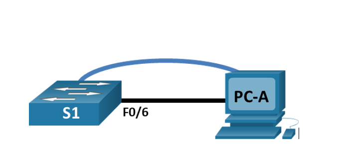
## Таблица адресации
|Устройство|Интерфейс|Ip-адрес/префикс|
|----------|---------|----------------|
|S1|VLAN1|192.168.1.2/24|
|PC-A|NIC|192.168.1.10/24|

## Задачи
### Часть 1 Проверка конфигурации коммутатора по умолчанию
### Часть 2 Создание сети и настройка основных параметров устройства
- Настройте базовые параметры коммутатора.
- Настройте IP-адрес для ПК.
### Часть 3
- Отобразите конфигурацию устройств
- Протестируйте сквозное соединение, отправив эхо-запрос.
- Протестируйте возможности удаленного управления с помощью Telnet.

## Выполнение
### Часть 1
- Шаг 1. Создать сеть согласно топологии.

Для начала необходимо подключить консольный кабель в соответствующие порты ПК и коммутатора.

Со стороны ПК подключение осуществляется через порт RS232.

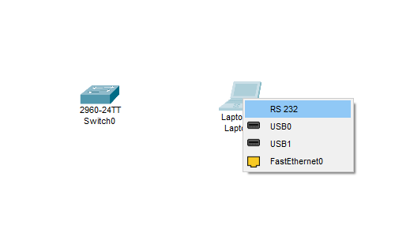

Со стороны коммутатора поделючение осуществляется через консольный порт.

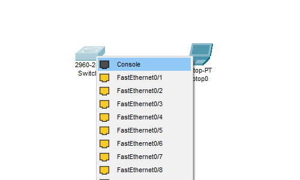

Откроем терминал консоли и проверим подключение. 

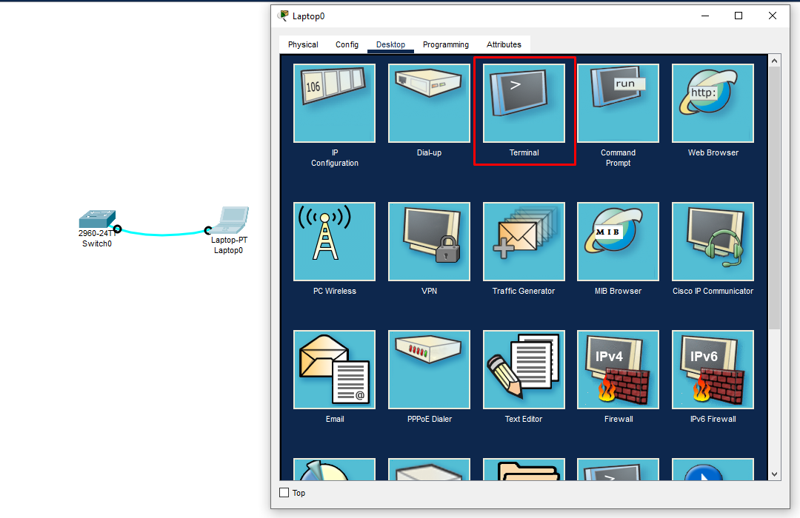

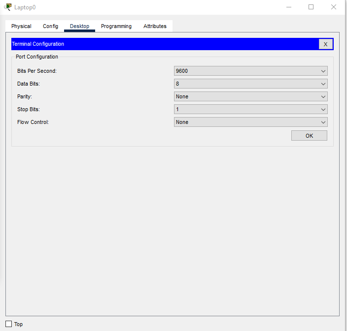

Конфигурацию оставляем по умолчанию.

Если к моменту подключения к коммутатору он был уже включен некоторое время, то в окне появится информация с логом загрузки операционной системы и общая информация о коммутаторе и ОС.

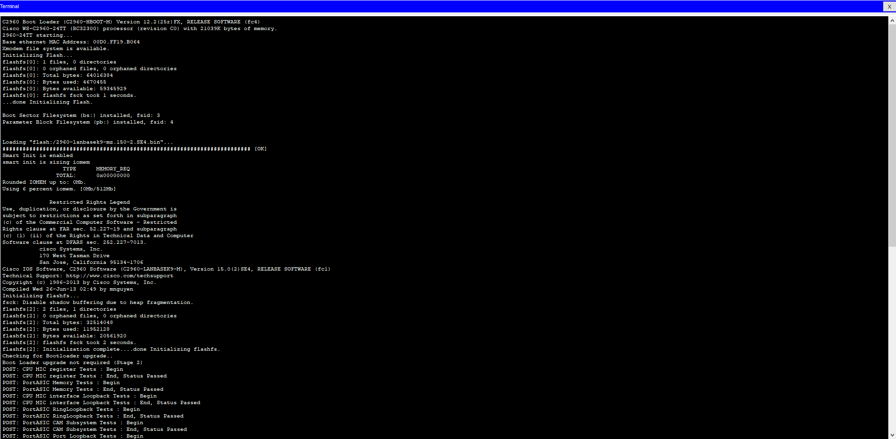

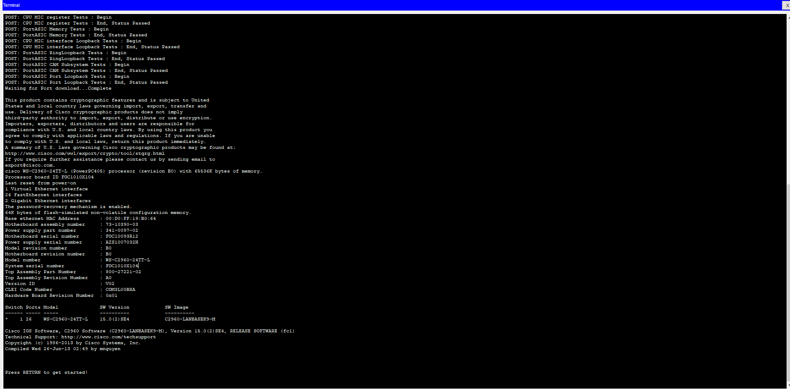

При первоначальной настройке коммутатора не удастся подключиться, используя ethernet порт так как при его использовании подключении осуществляется через telnet либо ssh. При использовании telnet либо ssh понадобится настроенный на коммутаторе ip адрес. Поэтому в условия не настроенного коммутатора необходимо использовать консольный кабель.

- Шаг 2. Проверить настройки коммутатора по умолчанию

a. зайдём в привелегированный режим, введя команду enable. В командной строке Switch> изменится на Switch#

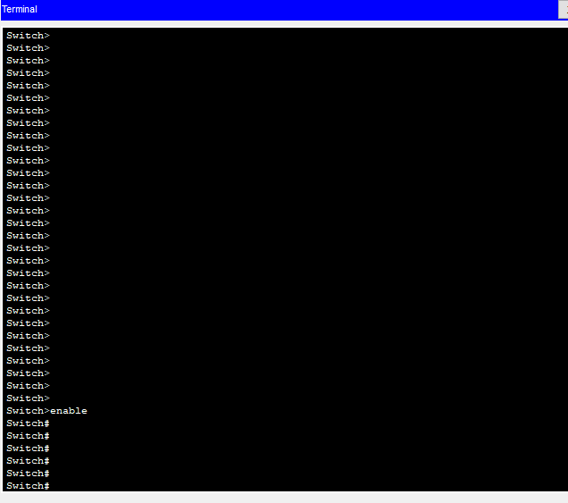

b.проверим конфигурацию с помощью команды `show running-config` из конфигурации видно что коммутатор имеет 24 порта FastEthernet и 2 порта GigabitEthernet
Видим диапозон значений линий vty  0 - 4 (пять линий виртуального терминала)
И также диапозон 5 - 15 (одиннадцать линий виртуального терминала)


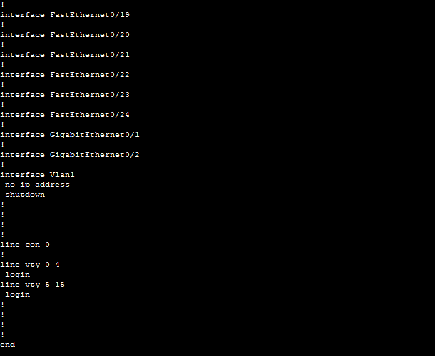

c. проверим файл загрузочной конфигурации в энергонезависимой памяти ОЗУ (NVRAM) с помощью команды `show stratup-config`
появляется сообщение "startup-config is not present". Это связано с тем что не файл конфигурации не сохранён в энергонезависимой памяти.


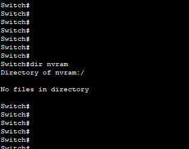

d.интерфейс VLAN1 выключен, ip адрес этому интрфейсу не назначен, mac адрес интерфейса 00:06:2a:98:68:a0

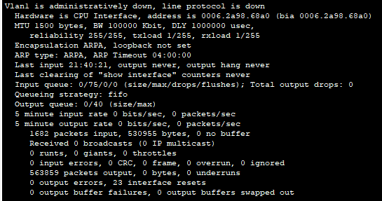

e. проверить ip-свойства vlan 1 можно командами `show running-config` и `show ip interface vlan 1`, `show interface vlan 1`. 

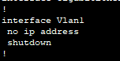


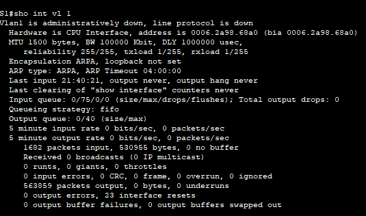

В нашем случае ip адрес не назначен.

f. Подсоединим ethernet кабель к порту FastEthernet 0/6 и дождёмся согласования параметров скорости и дуплекса между портами.

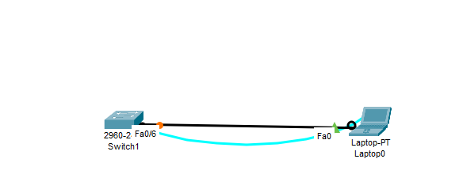

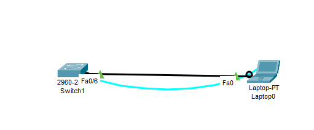

g. Изучим сведения о версии ОС Cisco IOS на коммутаторе.
в выводе можно увидеть что коммутатор под управлением ОС Cisco IOS версии 15.0(2)SE4
файл обраа системы имеет имя c2960-lanbasek9-mz.150-2.SE4.bin

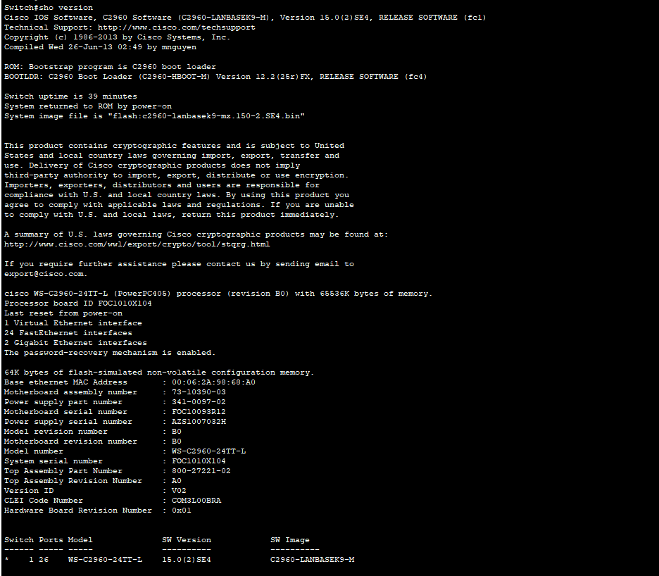

h. Изучим свойства по умолчанию интерфейса fastEthernet 0/6
Можно заметить что интерфейс включен, есть линк. Порт согласован на скорости 100 Мбит/с, полный дуплекс. Если отключить кабель то можно заметить что и интерфейс тоже отключается (line protocol is down (disabled)). Отсюда можно сделать вывод что интерфейс включается при наличии линка между устройствами.

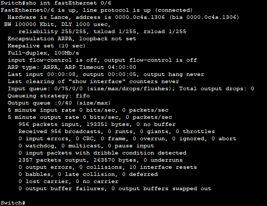

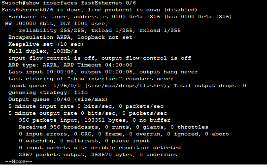

i. Изучим флеш память.
при введении команд `show flash` либо `dir flash:` можно увидеть список файлов, сохранённых на флеш памяти
можно увидеть что образу ОС присвоено имя 2960-lanbasek9-mz.150-2.SE4.bin

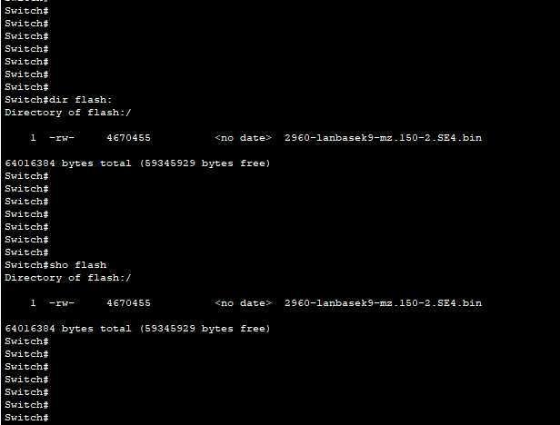

## Часть 2 Настройка базовых параметров сетевых устройств
- Шаг 1. Настроим базовые параметры коммутатора.

a. В режиме глобальной конфигурации введём следующие команды:

`no ip domain-lookup` (отключение преобразования имён в IP адреса)

`hostname S1` (изменение имени коммутатора со Switch на S1)

`service password-encryption` (включение шифрования паролей)

`enable secret class` (установка пароля "class" для привелегированного режима)

`banner motd #` (Установка баннера, отображаемого при заходе на коммутатор)

`Unauthorized access is strictly prohibited. #` (Сообщение в баннере)

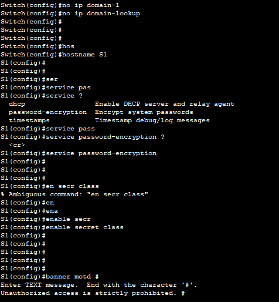

b. Назначим ip адрес для удалённого управления на vlan 1. 
Для коммутатора будет назначен адрес 192.168.1.2 с маской 255.255.255.0

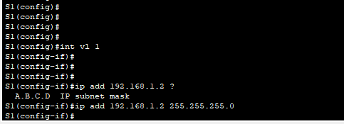

vlan 1 необходимо включить если он находится в состоянии shutdown

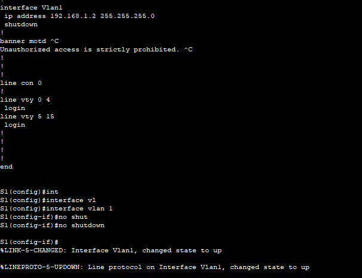

Предположим что будущем планируется расширение сети и будут использоваться несколько коммутаторов. Для этого потребуется шлюз по умолчанию.

Вернёмся в режим глобальной конфигурации и назначим шлюз по умолчанию 192.168.1.1 командой `ip default-gateway 192.168.1.1`


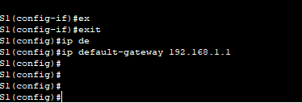

с. Ограничим доступ через консольный порт.
Заходим в настройки консольной линии командой `line console 0`
Задаём пароль "cisco" командой `password cisco`


Включаем проверку пароля командой `login`

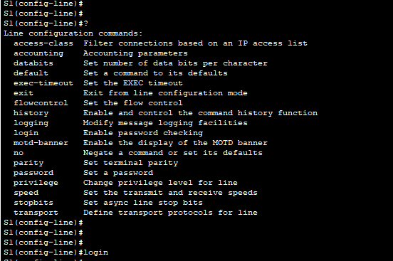

Чтобы консольные сообщения не прерывали выполнение команд введём команду `logging synchronous`

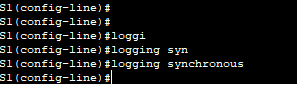

d. Настроим каналы виртуального терминала для обеспечения доступа через telnet.
настроим линии с 0 по 15, установив  пароль "cisco" командой `password 7 cisco`
выдаётся сообщение  "Invalid encrypted password: cisco"

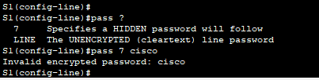

Почему так случилось? `7` в команде означает метод шифрования по алгоритму Виженера. Однако если до этого была введена комманда `service password-encryption`, то этот метод применится по умолчанию. Соответственно необходимо ввести `password cisco`. При проверке настроек можно будет увидеть что пароль зашифрован этим методом.

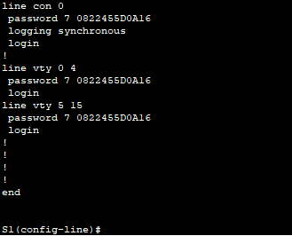

Шаг 2 Настроим ip-адрес на ПК.

Установим ip адрес 192.168.1.10 с маской 255.255.255.0

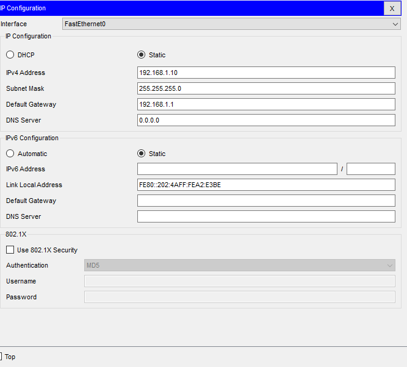

### Часть 3. Проверка сетевых подключений.

Шаг 1 проверим конфигурацию коммутатора.

```
S1#sh run

Building configuration...

Current configuration : 1361 bytes
!
version 15.0
no service timestamps log datetime msec
no service timestamps debug datetime msec
service password-encryption
!
hostname S1
!
enable secret 5 $1$mERr$9cTjUIEqNGurQiFU.ZeCi1
!
!
!
no ip domain-lookup
!
!
!
spanning-tree mode pvst
spanning-tree extend system-id
!
interface FastEthernet0/1
 shutdown
!
interface FastEthernet0/2
!
interface FastEthernet0/3
!
interface FastEthernet0/4
!
interface FastEthernet0/5
!
interface FastEthernet0/6
!
interface FastEthernet0/7
!
interface FastEthernet0/8
!
interface FastEthernet0/9
!
interface FastEthernet0/10
!
interface FastEthernet0/11
!
interface FastEthernet0/12
!
interface FastEthernet0/13
!
interface FastEthernet0/14
!
interface FastEthernet0/15
!
interface FastEthernet0/16
!
interface FastEthernet0/17
!
interface FastEthernet0/18
!
interface FastEthernet0/19
!
interface FastEthernet0/20
!
interface FastEthernet0/21
!
interface FastEthernet0/22
!
interface FastEthernet0/23
!
interface FastEthernet0/24
!
interface GigabitEthernet0/1
!
interface GigabitEthernet0/2
!
interface Vlan1
 ip address 192.168.1.2 255.255.255.0
!
ip default-gateway 192.168.1.1
!
banner motd ^C
Unauthorized access is strictly prohibited. ^C
!
!
!
line con 0
 password 7 0822455D0A16
 logging synchronous
 login
!
line vty 0 4
 password 7 0822455D0A16
 login
line vty 5 15
 password 7 0822455D0A16
 login
!
!
!
!
end
```


b. проверим параметры vlan 1

```
S1#sho int vlan 1
Vlan1 is up, line protocol is up
  Hardware is CPU Interface, address is 0006.2a98.68a0 (bia 0006.2a98.68a0)
  Internet address is 192.168.1.2/24
  MTU 1500 bytes, BW 100000 Kbit, DLY 1000000 usec,
     reliability 255/255, txload 1/255, rxload 1/255
  Encapsulation ARPA, loopback not set
  ARP type: ARPA, ARP Timeout 04:00:00
  Last input 21:40:21, output never, output hang never
  Last clearing of "show interface" counters never
  Input queue: 0/75/0/0 (size/max/drops/flushes); Total output drops: 0
  Queueing strategy: fifo
  Output queue: 0/40 (size/max)
  5 minute input rate 0 bits/sec, 0 packets/sec
  5 minute output rate 0 bits/sec, 0 packets/sec
     1682 packets input, 530955 bytes, 0 no buffer
     Received 0 broadcasts (0 IP multicast)
     0 runts, 0 giants, 0 throttles
     0 input errors, 0 CRC, 0 frame, 0 overrun, 0 ignored
     563859 packets output, 0 bytes, 0 underruns
     0 output errors, 23 interface resets
     0 output buffer failures, 0 output buffers swapped out
```

Видим что интерфейс работает, назанчен ip адрес 192.168.1.2 с маской 255.255.255.0
В выводе мы можем увидеть BW 100000 Kbit. Это означает полосу пропускания 100000 Кбит/с (97,65 Мбит/с)


Шаг 2. Проверим связь ПК с коммутатором.

Шаг 3. Проверим удалённое управление коммутатором.

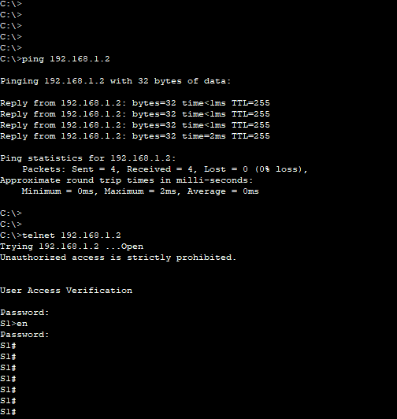

Сохраним конфигурацию коммутатора в энергонезависимой памяти командой `copy running-config startup-config`. Проверяем наличие файла конфигурации командой `dir nvram:`. Проверяем startup config командой `show startup-config`.
После перезагрузки коммутатора, либо после его отключения настройки не пропадут.

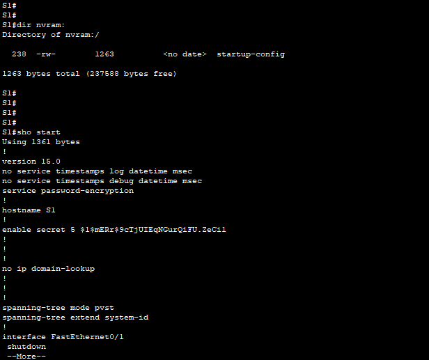
