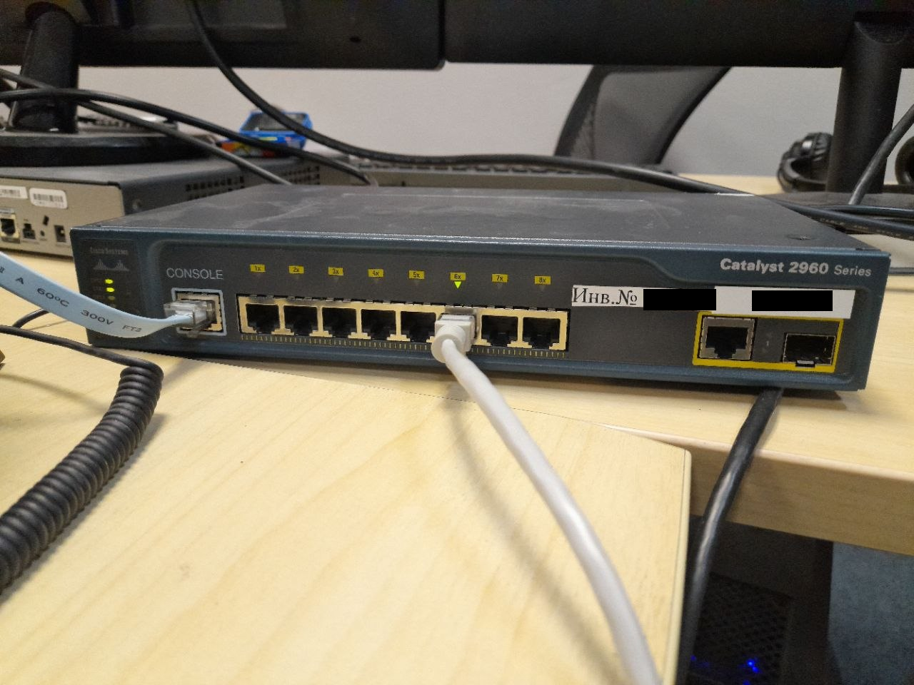

# Лабораторная работа №1. Базовая настройка коммутатора

## Топология


## Таблица адресации
|устройство|интерфейс|IP-адрес|маска подсети|
|----------|---------|--------|-------------|
|S1|VLAN1|192.168.1.11|255.255.255.0|
|S2|VLAN2|192.168.1.12|255.255.255.0|
|PC-A|NIC|192.168.1.1|255.255.255.0|
|PC-B|NIC|192.168.1.2|255.255.255.0|

## Задачи
### Часть 1. Создание и настройка сети

Шаг 1. Подключите сеть в соответствии с топологией.

Шаг 2. Настройте узлы ПК.

Шаг 3. Выполните инициализацию и перезагрузку коммутаторов.

Шаг 4. Настройте базовые параметры каждого коммутатора.

a. Настройте имена устройств в соответствии с топологией.

b. Настройте IP-адреса, как указано в таблице адресации.

c. Назначьте cisco в качестве паролей консоли и VTY.

d. Назначьте class в качестве пароля доступа к привилегированному режиму EXEC.

### Часть 2. Изучение таблицы МАС-адресов коммутатора


## Выполнение

### Часть 1
- Шаг 1. Подключим сеть согласно топологии.


- Шаг 2. Настроим узлы ПК.

- Для PC-A


- Для PC-B


- шаг 3. Выполним инициализацию и перезагрузку каждого коммутатора.

для этого соединим S1 и PC-A консольным кабелем. Тоже самое сделаем для S2 и PC-B.


далее воспользуемся командой `reload`


тоже самое проделаем для другого коммутатора.

-Шаг 4. Настроим базовые параметры каждого коммутатора.

- Для S1

```
Switch(config)#hostname S1
S1(config)#service password-encryption
S1(config)#line vty 0 15
S1(config-line)#password cisco
S1(config-line)#login
S1(config-line)#exit
S1(config)#enable secret class
S1(config)# int vlan 1
S1(config-if)#ip add 192.168.1.11 255.255.255.0
S1(config-if)#no shutdown
S1#copy running-config startup-config
```

- Для S2

```
Switch(config)#hostname S2
S2(config)#service password-encryption
S2(config)#line vty 0 15
S2(config-line)#password cisco
S2(config-line)#login
S2(config-line)#exit
S2(config)#enable secret class
S2(config)#int vlan 1
S2(config-if)#no shutdown
S2(config-if)#ip add 192.168.1.12 255.255.255.0
S2(config-if)#end
S2#copy running-config startup-config
```

№## Часть 2. зучение таблицы МАС-адресов коммутатор.

- Шаг 1. Изучим мак адреса сетевых устройств.
Изучим вывод команды `ipconfig /all` на ПК.

- PC-A
```
C:\>ipconfig /all

FastEthernet0 Connection:(default port)

   Connection-specific DNS Suffix..: 
   Physical Address................: 0001.6328.A230
   Link-local IPv6 Address.........: FE80::201:63FF:FE28:A230
   IPv6 Address....................: ::
   IPv4 Address....................: 192.168.1.1
   Subnet Mask.....................: 255.255.255.0
   Default Gateway.................: ::
                                     0.0.0.0
   DHCP Servers....................: 0.0.0.0
   DHCPv6 IAID.....................: 
   DHCPv6 Client DUID..............: 00-01-00-01-BC-97-D0-9C-00-01-63-28-A2-30
   DNS Servers.....................: ::
                                     0.0.0.0

Bluetooth Connection:

   Connection-specific DNS Suffix..: 
   Physical Address................: 00E0.8FB5.2711
   Link-local IPv6 Address.........: ::
   IPv6 Address....................: ::
   IPv4 Address....................: 0.0.0.0
   Subnet Mask.....................: 0.0.0.0
   Default Gateway.................: ::
                                     0.0.0.0
   DHCP Servers....................: 0.0.0.0
   DHCPv6 IAID.....................: 
   DHCPv6 Client DUID..............: 00-01-00-01-BC-97-D0-9C-00-01-63-28-A2-30
   DNS Servers.....................: ::
                                     0.0.0.0
```

- PC-B

```
C:\>ipconfig /all

FastEthernet0 Connection:(default port)

   Connection-specific DNS Suffix..: 
   Physical Address................: 00D0.D3A0.D11E
   Link-local IPv6 Address.........: FE80::2D0:D3FF:FEA0:D11E
   IPv6 Address....................: ::
   IPv4 Address....................: 192.168.1.2
   Subnet Mask.....................: 255.255.255.0
   Default Gateway.................: ::
                                     0.0.0.0
   DHCP Servers....................: 0.0.0.0
   DHCPv6 IAID.....................: 
   DHCPv6 Client DUID..............: 00-01-00-01-38-94-D9-E1-00-D0-D3-A0-D1-1E
   DNS Servers.....................: ::
                                     0.0.0.0

Bluetooth Connection:

   Connection-specific DNS Suffix..: 
   Physical Address................: 00D0.BA4E.2787
   Link-local IPv6 Address.........: ::
   IPv6 Address....................: ::
   IPv4 Address....................: 0.0.0.0
   Subnet Mask.....................: 0.0.0.0
   Default Gateway.................: ::
                                     0.0.0.0
   DHCP Servers....................: 0.0.0.0
   DHCPv6 IAID.....................: 
   DHCPv6 Client DUID..............: 00-01-00-01-38-94-D9-E1-00-D0-D3-A0-D1-1E
   DNS Servers.....................: ::
                                     0.0.0.0
```

В выводе команды мы можем увидеть мак адресав строке `Physical address`.

Для PA-A: 0001.6328.A230

Для PC-B: 00D0.D3A0.D11E

Подключимся по консольному порту к коммутаторам S1 и S2. На каждом коммутаторе введём команду `show interface F0/1`

- S1

```
S1>en
Password:
S1#show int fa0/1
FastEthernet0/1 is up, line protocol is up (connected)
  Hardware is Lance, address is 0090.0cb8.7b01 (bia 0090.0cb8.7b01)
 BW 100000 Kbit, DLY 1000 usec,
     reliability 255/255, txload 1/255, rxload 1/255
  Encapsulation ARPA, loopback not set
  Keepalive set (10 sec)
  Full-duplex, 100Mb/s
  input flow-control is off, output flow-control is off
  ARP type: ARPA, ARP Timeout 04:00:00
  Last input 00:00:08, output 00:00:05, output hang never
  Last clearing of "show interface" counters never
  Input queue: 0/75/0/0 (size/max/drops/flushes); Total output drops: 0
  Queueing strategy: fifo
  Output queue :0/40 (size/max)
  5 minute input rate 0 bits/sec, 0 packets/sec
  5 minute output rate 0 bits/sec, 0 packets/sec
     956 packets input, 193351 bytes, 0 no buffer
     Received 956 broadcasts, 0 runts, 0 giants, 0 throttles
     0 input errors, 0 CRC, 0 frame, 0 overrun, 0 ignored, 0 abort
     0 watchdog, 0 multicast, 0 pause input
     0 input packets with dribble condition detected
     2357 packets output, 263570 bytes, 0 underruns
     0 output errors, 0 collisions, 10 interface resets
     0 babbles, 0 late collision, 0 deferred
     0 lost carrier, 0 no carrier
     0 output buffer failures, 0 output buffers swapped out
```

- S2

```
S2>en
Password: 
S2#sho int fa0/1
FastEthernet0/1 is up, line protocol is up (connected)
  Hardware is Lance, address is 0007.ecb2.ae01 (bia 0007.ecb2.ae01)
 BW 100000 Kbit, DLY 1000 usec,
     reliability 255/255, txload 1/255, rxload 1/255
  Encapsulation ARPA, loopback not set
  Keepalive set (10 sec)
  Full-duplex, 100Mb/s
  input flow-control is off, output flow-control is off
  ARP type: ARPA, ARP Timeout 04:00:00
  Last input 00:00:08, output 00:00:05, output hang never
  Last clearing of "show interface" counters never
  Input queue: 0/75/0/0 (size/max/drops/flushes); Total output drops: 0
  Queueing strategy: fifo
  Output queue :0/40 (size/max)
  5 minute input rate 0 bits/sec, 0 packets/sec
  5 minute output rate 0 bits/sec, 0 packets/sec
     956 packets input, 193351 bytes, 0 no buffer
     Received 956 broadcasts, 0 runts, 0 giants, 0 throttles
     0 input errors, 0 CRC, 0 frame, 0 overrun, 0 ignored, 0 abort
     0 watchdog, 0 multicast, 0 pause input
     0 input packets with dribble condition detected
     2357 packets output, 263570 bytes, 0 underruns
     0 output errors, 0 collisions, 10 interface resets
     0 babbles, 0 late collision, 0 deferred
     0 lost carrier, 0 no carrier
     0 output buffer failures, 0 output buffers swapped out
```

Из вывода команды мы можем увидеть мак-адрес интерфейса и вшитый адрес (bia). Можно заметить что оба адреса совпадают.

S1: 0090.0cb8.7b01

S2: 0007.ecb2.ae01

- Шаг 2. Посмотреть таблицу MAC-адресов коммутатора.

Подключимся по консольному порту коммутатора S2. из привилегированного режима введём команду `show mac address-table`

```
S2>en
Password:
S2#sho mac add
          Mac Address Table
-------------------------------------------

Vlan    Mac Address       Type        Ports
----    -----------       --------    -----

   1    0090.0cb8.7b01    DYNAMIC     Fa0/1
S2#
```

из вывода команды виден только мак от S1

### ВАЖНОЕ НАБЛЮДЕНИЕ

В методичке указано:

```
Даже если сетевая коммуникация в сети не происходила (т. е. если команда ping не отправлялась), коммутатор может узнать МАС-адреса при подключении к ПК и другим коммутаторам.
```

Однако в Cisco Packet Tracer 8.1.1 мак-адреса ПК будут отображаться после успешного ICMP-запроса к коммутатору. Ребут программы желаемого результата не дал. В реальности всё действительно будет так как описано выше если настройки корректны.

Для воспроизводства желаемого результата был взят реальный коммутатор Cisco Catalyst 2960.


