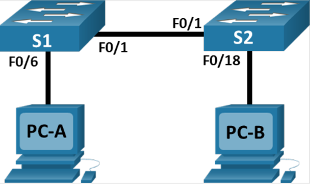
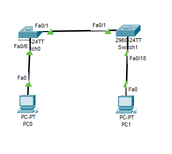
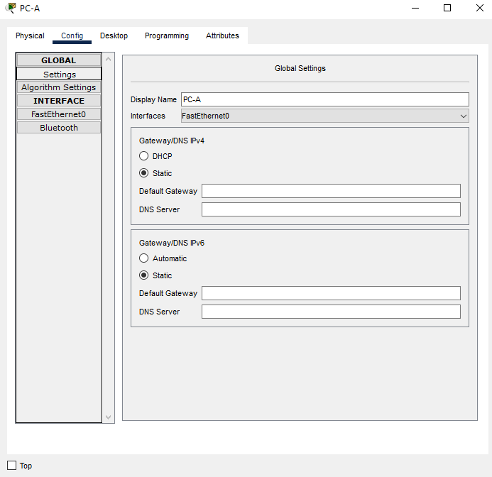
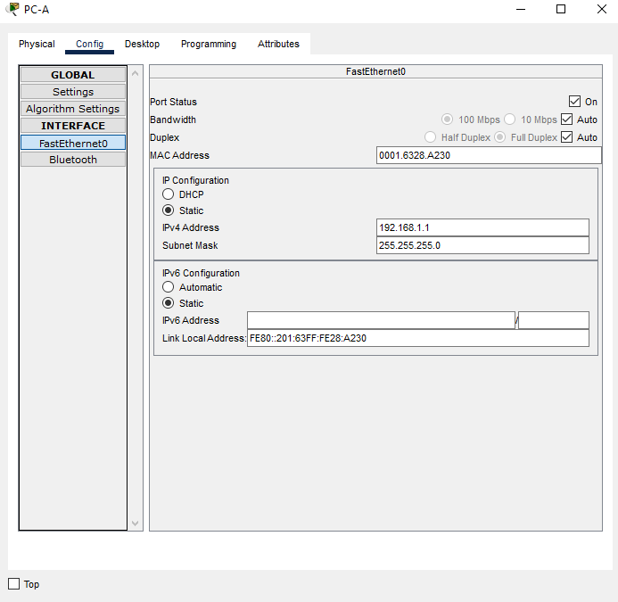
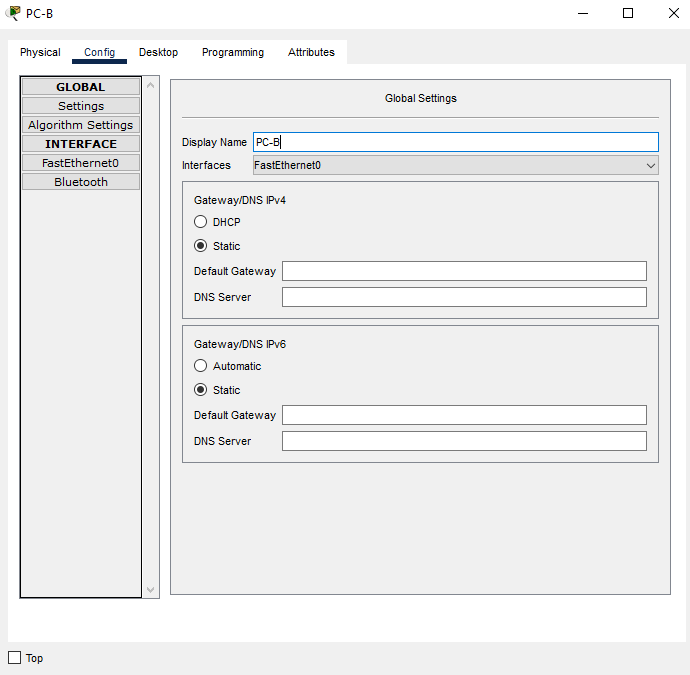
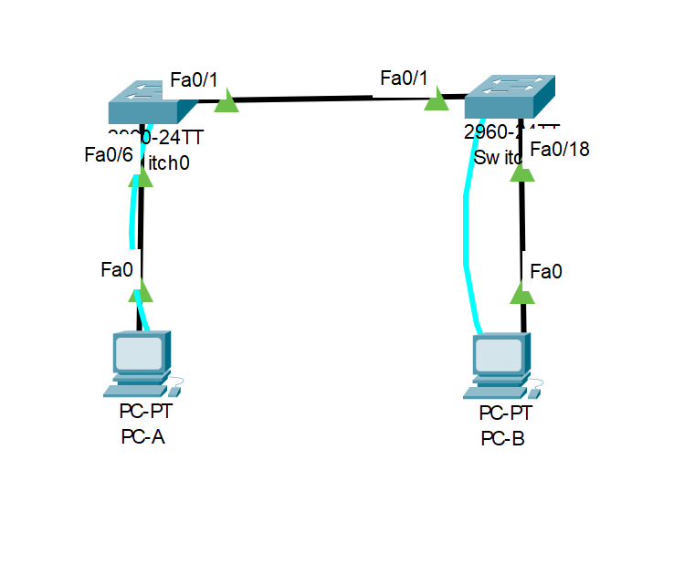
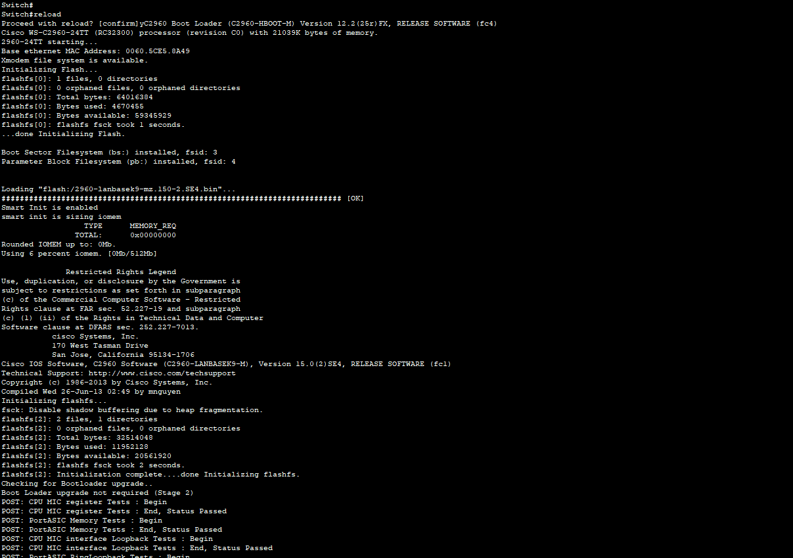

# Лабораторная работа №1. Базовая настройка коммутатора

## Топология


## Таблица адресации
|устройство|интерфейс|IP-адрес|маска подсети|
|----------|---------|--------|-------------|
|S1|VLAN1|192.168.1.11|255.255.255.0|
|S2|VLAN2|192.168.1.12|255.255.255.0|
|PC-A|NIC|192.168.1.1|255.255.255.0|
|PC-B|NIC|192.168.1.2|255.255.255.0|

## Задачи
### Часть 1. Создание и настройка сети

Шаг 1. Подключите сеть в соответствии с топологией.

Шаг 2. Настройте узлы ПК.

Шаг 3. Выполните инициализацию и перезагрузку коммутаторов.

Шаг 4. Настройте базовые параметры каждого коммутатора.

a. Настройте имена устройств в соответствии с топологией.

b. Настройте IP-адреса, как указано в таблице адресации.

c. Назначьте cisco в качестве паролей консоли и VTY.

d. Назначьте class в качестве пароля доступа к привилегированному режиму EXEC.

### Часть 2. Изучение таблицы МАС-адресов коммутатора


## Выполнение

### Часть 1
- Шаг 1. Подключим сеть согласно топологии.



- Шаг 2. Настроим узлы ПК.

- Для PC-A





- Для PC-B




- шаг 3. Выполним инициализацию и перезагрузку каждого коммутатора.

для этого соединим S1 и PC-A консольным кабелем. Тоже самое сделаем для S1 и PC-B.



далее воспользуемся командой `reload`



тоже самое проделаем для другого коммутатора.

-Шаг 4. Настроим базовые параметры каждого коммутатора.

```
Switch(config)#hostname S1
S1(config)#service password-encryption
S1(config)#line vty 0 15
S1(config-line)#password cisco
S1(config-line)#login
S1(config-line)#exit
S1(config)#enable secret class
S1(config)# int vlan 1
S1(config-if)#ip add 192.168.1.11 255.255.255.0
S1(config-if)#no shutdown
S1#copy running-config startup-config
```
