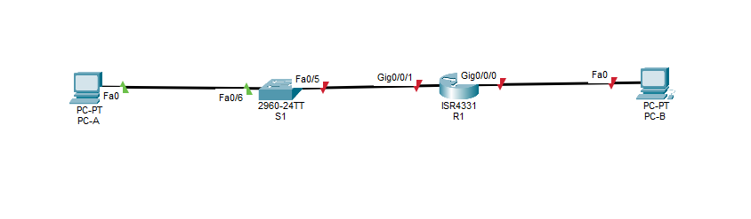

# Лабораторная работа №4. Настройка IPv6-адресов на сетевых устройствах 

## Топология


## Таблица адресации

|Устройство|Интерфейс|IPv6-адрес|Link local IPv6-адрес|Длина префикса|Шлюз по умолчанию|
|----------|---------|----------|---------------------|--------------|-----------------|
|R1|G0/0/0|2001:db8:acad:a::1|fe80::1|64|-|
| |G0/0/1|2001:db8:acad:1::1|fe80::1|64|-|
|S1|VLAN1|2001:db8:acad:1::b|fe80::b|64|-|
|PC-A|NIC|2001:db8:acad:1::3|SLAAC|64|fe80::1|
|PC-B|NIC|2001:db8:acad:a::3|SLAAC|64|fe80::1|

## Задачи

- Часть 1. Настройка топологии и конфигурация основных параметров маршрутизатора и коммутатора

- Часть 2. Ручная настройка IPv6-адресов

- Часть 3. Проверка сквозного соединения

## Выполнение

### Часть 1

настроим топологию сети



Подключив консольный кабель между PC-A и S1 настроим основные параметры

```
Switch>en
Switch#conf t
Switch(config)#no ip domain-lookup
Switch(config)#hostname S1
S1(config)#service password-encryption
S1(config)#enable secret class
S1(config)#line con 0
S1(config-line)#password cisco
S1(config-line)#login
S1(config-line)#exit
S1(config)#line vty 0 15
S1(config-line)#password cisco
S1(config-line)#login
S1(config-line)#end
S1#copy running-config startup-config
```

Для работы с IPv6 адресами на коммутаторах Cisco 2960 необходимо изменить шаблон работы его операционной системы и перезагрузить.

Проверим используемый шаблон и сменим его.

```
S1(config)#do show sdm pref
 The current template is "default" template.
 The selected template optimizes the resources in
 the switch to support this level of features for
 0 routed interfaces and 1024 VLANs.

  number of unicast mac addresses:                  8K
  number of IPv4 IGMP groups + multicast routes:    0.25K
  number of IPv4 unicast routes:                    0
  number of IPv6 multicast groups:                  0
  number of directly-connected IPv6 addresses:      0
  number of indirect IPv6 unicast routes:           0
  number of IPv4 policy based routing aces:         0
  number of IPv4/MAC qos aces:                      0.125k
  number of IPv4/MAC security aces:                 0.375k
  number of IPv6 policy based routing aces:         0
  number of IPv6 qos aces:                          20
  number of IPv6 security aces:                     25
S1(config)#sdm prefer dual-ipv4-and-ipv6 default
Changes to the running SDM preferences have been stored, but cannot take effect until the next reload.
Use 'show sdm prefer' to see what SDM preference is currently active.
S1(config)#end
S1#reload
```

После перезагрузки мы можем проверить какой шаблон используется для работы коммутатора

```
S1#show sdm prefer 
 The current template is "dual-ipv4-and-ipv6 default" template.
 The selected template optimizes the resources in
 the switch to support this level of features for
 0 routed interfaces and 1024 VLANs.

  number of unicast mac addresses:                  4K
  number of IPv4 IGMP groups + multicast routes:    0.25K
  number of IPv4 unicast routes:                    0
  number of IPv6 multicast groups:                  0.375k
  number of directly-connected IPv6 addresses:      0
  number of indirect IPv6 unicast routes:           0
  number of IPv4 policy based routing aces:         0
  number of IPv4/MAC qos aces:                      0.125K
  number of IPv4/MAC security aces:                 0.375K
  number of IPv6 policy based routing aces:         0
  number of IPv6 qos aces:                          0.625k
  number of IPv6 security aces:                     0.125K
```

Далее настроим маршрутизатор, подключив PC-B к нему через консольный кабель

```
Router>en
Router#conf t
Router(config)#no ip domain-lookup
Router(config)#hostname R1
R1(config)#service password-encryption
R1(config)#enable secret class
R1(config)#line con 0
R1(config-line)#password cisco
R1(config-line)#login
R1(config-line)#exit
R1(config)#line vty 0 15
R1(config-line)#password cisco
R1(config-line)#login
R1(config-line)#end
R1#copy running-config startup-config
```

### Часть 2 Ручная настройка IPv6-адресов

назначим глобальные индивидуальные IPv6-адреса интерфейсам Ethernet на R1

```
R1(config)#interface gigabitEthernet 0/0/0
R1(config-if)#no shutdown
R1(config-if)#ipv6 address 2001:db8:acad:a::1/64
R1(config-if)#exit
R1(config)#int gi 0/0/1
R1(config-if)#no shutdown
R1(config-if)#ipv6 address 2001:db8:acad:1::1/64
```

Проверим какие IPv6-адреса назначены интерфейсам.

```
R1#show ipv6 interface brief 
GigabitEthernet0/0/0       [up/up]
    FE80::200:CFF:FE77:AB01
    2001:DB8:ACAD:A::1
GigabitEthernet0/0/1       [up/up]
    FE80::200:CFF:FE77:AB02
    2001:DB8:ACAD:1::1
GigabitEthernet0/0/2       [administratively down/down]
    unassigned
Vlan1                      [administratively down/down]
    unassigned
```

Из вывода команды мы видим что лоакльные адреса не совпадают с теми что, должны быть в таблице адресации.
Это случилось потому что каждому интерефейсу автоматически присваевается уникальный локальный IPv6 адрес. InterfaceID назначается с использованием генератора случайных чисел либо с использованием процесса EUI-64.
В случае с маршрутизатором можно увидеть что InterfaceID назначены с использованием EUI-64. Так как для назначения адреса используется мак адрес интерфейса, в середину вставляется значение fffe, 7-й бит мак адреса меняется с двоичного 0 на 1

Проверим:

```
R1#show interfaces gi0/0/0
GigabitEthernet0/0/0 is up, line protocol is up (connected)
  Hardware is ISR4331-3x1GE, address is 0000.0c77.ab01 (bia 0000.0c77.ab01)
  
R1#show ipv6 interface gigabitEthernet 0/0/0
GigabitEthernet0/0/0 is up, line protocol is up
  IPv6 is enabled, link-local address is FE80::200:CFF:FE77:AB01
  ```
  
 Видим что мак `000.0c77.ab01` преобразован в индентификатор интерфейса `200:CFF:FE77:AB01`
 
 К маку добавлен link-local префикс `FE80::/64`
 
 таким образом мы получили LLA `FE80::200:CFF:FE77:AB01` с использованием метода EUI-64
 
 Введём локальные адреса вручную
 
 ```
 R1(config)#interface gigabitEthernet 0/0/0
 R1(config-if)#ipv6 address fe80::1 link-local
 R1(config-if)#exit
 R1(config)#interface gigabitEthernet 0/0/1
 R1(config-if)#ipv6 address fe80::1 link-local
 R1(config-if)#end
 R1#copy running-config startup-config
 ```
 
 Проверим
 
 ```
 
R1#sho ipv6 interface brief 
GigabitEthernet0/0/0       [up/up]
    FE80::1
    2001:DB8:ACAD:A::1
GigabitEthernet0/0/1       [up/up]
    FE80::1
    2001:DB8:ACAD:1::1
GigabitEthernet0/0/2       [administratively down/down]
    unassigned
Vlan1                      [administratively down/down]
    unassigned
R1#
```

Проверим к каким группам присрединён интерфейс GigabitEthernet0/0/0 на R1

```
R1#sho ipv6 interface gigabitEthernet 0/0/0
GigabitEthernet0/0/0 is up, line protocol is up
  IPv6 is enabled, link-local address is FE80::1
  No Virtual link-local address(es):
  Global unicast address(es):
    2001:DB8:ACAD:A::1, subnet is 2001:DB8:ACAD:A::/64
  Joined group address(es):
    FF02::1
    FF02::1:FF00:1
```

Видим что он присоединён к группам многоадресной рассылки для всех устройств `FF02::1` и на группу для многоадресной рассылки `FF02::1:FF00:1` это значит что адреса с с последними 24 битами в адресе со значением `00:0001` будут получателями в рассылке с интерфейса gigabitEthernet 0/0/0.

Проверим настройки на PC-B

```
FastEthernet0 Connection:(default port)

   Connection-specific DNS Suffix..: 
   Link-local IPv6 Address.........: FE80::290:CFF:FEE8:3973
   IPv6 Address....................: ::
   IPv4 Address....................: 0.0.0.0
   Subnet Mask.....................: 0.0.0.0
   Default Gateway.................: ::
                                     0.0.0.0
```

Видим что интерфейсу назначен только LLA

Активируем IPv6 маршрутизацию на R1

```
R1(config)#ipv6 unicast-routing 
```

После этого мы можеи увидеть что интерефейс маршрутизатора состояит в группе рассылки для всех маршрутизаторов `FF02::2`

```
R1#show ipv6 interface gigabitEthernet 0/0/0
GigabitEthernet0/0/0 is up, line protocol is up
  IPv6 is enabled, link-local address is FE80::1
  No Virtual link-local address(es):
  Global unicast address(es):
    2001:DB8:ACAD:A::1, subnet is 2001:DB8:ACAD:A::/64
  Joined group address(es):
    FF02::1
    FF02::2
    FF02::1:FF00:
```

проверим ещё раз

```
C:\>ipconfig

FastEthernet0 Connection:(default port)

   Connection-specific DNS Suffix..: 
   Link-local IPv6 Address.........: FE80::290:CFF:FEE8:3973
   IPv6 Address....................: ::
   IPv4 Address....................: 0.0.0.0
   Subnet Mask.....................: 0.0.0.0
   Default Gateway.................: ::
                                     0.0.0.0
```

И ничего не поменялось. настроим интерфейс PC-B на автоматическое получение IPv6-адреса и проверим снова

```
C:\>ipconfig

FastEthernet0 Connection:(default port)

   Connection-specific DNS Suffix..: 
   Link-local IPv6 Address.........: FE80::290:CFF:FEE8:3973
   IPv6 Address....................: 2001:DB8:ACAD:A:290:CFF:FEE8:3973
   IPv4 Address....................: 0.0.0.0
   Subnet Mask.....................: 0.0.0.0
   Default Gateway.................: FE80::1
                                     0.0.0.0
```

Как получился такой IPv6-адрес на PC-B

 - R1 послал Router Advertisment с префиксом `2001:DB8:ACAD` и идентификатором подсети `A::`
 - PC-B получил RA, извлёк префикс и добавил свои идентификатор интерфейса `290:CFF:FEE8:3973`

Назначим IPv6-адреса интерфейсу управления на S1

```
S1(config)#interface vlan 1
S1(config-if)#no shutdown 
S1(config-if)#ipv6 address 2001:db8:acad:1::b/64
S1(config-if)#ipv6 address fe80::b  link-local 
```

проверим правильность назначения адреса

```
S1#show ipv6 interface vlan 1
Vlan1 is up, line protocol is up
  IPv6 is enabled, link-local address is FE80::B
  No Virtual link-local address(es):
  Global unicast address(es):
    2001:DB8:ACAD:1::B, subnet is 2001:DB8:ACAD:1::/64
  Joined group address(es):
    FF02::1
    FF02::1:FF00:B
```

Назначим компьютерам статические IPv6 адреса и проверим сквозное подключение.

Отправим с PC-A  эхо-запрос на FE80::1

```
C:\>ping fe80::1

Pinging fe80::1 with 32 bytes of data:

Reply from FE80::1: bytes=32 time<1ms TTL=255
Reply from FE80::1: bytes=32 time<1ms TTL=255
Reply from FE80::1: bytes=32 time<1ms TTL=255
Reply from FE80::1: bytes=32 time<1ms TTL=255

Ping statistics for FE80::1:
    Packets: Sent = 4, Received = 4, Lost = 0 (0% loss),
Approximate round trip times in milli-seconds:
    Minimum = 0ms, Maximum = 0ms, Average = 0ms
```

Отправим эхо-запрос на интерфейс управления S1 с PC-A.

```
C:\>ping 2001:db8:acad:1::b

Pinging 2001:db8:acad:1::b with 32 bytes of data:

Reply from 2001:DB8:ACAD:1::B: bytes=32 time<1ms TTL=255
Reply from 2001:DB8:ACAD:1::B: bytes=32 time<1ms TTL=255
Reply from 2001:DB8:ACAD:1::B: bytes=32 time<1ms TTL=255
Reply from 2001:DB8:ACAD:1::B: bytes=32 time<1ms TTL=255

Ping statistics for 2001:DB8:ACAD:1::B:
    Packets: Sent = 4, Received = 4, Lost = 0 (0% loss),
Approximate round trip times in milli-seconds:
    Minimum = 0ms, Maximum = 0ms, Average = 0ms

C:\>ping fe80::b

Pinging fe80::b with 32 bytes of data:

Reply from FE80::B: bytes=32 time<1ms TTL=255
Reply from FE80::B: bytes=32 time<1ms TTL=255
Reply from FE80::B: bytes=32 time<1ms TTL=255
Reply from FE80::B: bytes=32 time<1ms TTL=255

Ping statistics for FE80::B:
    Packets: Sent = 4, Received = 4, Lost = 0 (0% loss),
Approximate round trip times in milli-seconds:
    Minimum = 0ms, Maximum = 0ms, Average = 0ms
```

проведём трассировку между PC-A и PC-B

```
C:\>tracert 2001:db8:acad:a::3

Tracing route to 2001:db8:acad:a::3 over a maximum of 30 hops: 

  1   0 ms      0 ms      0 ms      2001:DB8:ACAD:1::1
  2   13 ms     0 ms      0 ms      2001:DB8:ACAD:A::3

Trace complete.
```

Отправим эхо-запрос из PC-B до PC-A

```
C:\>ping 2001:DB8:ACAD:1::1

Pinging 2001:DB8:ACAD:1::1 with 32 bytes of data:

Reply from 2001:DB8:ACAD:1::1: bytes=32 time<1ms TTL=255
Reply from 2001:DB8:ACAD:1::1: bytes=32 time<1ms TTL=255
Reply from 2001:DB8:ACAD:1::1: bytes=32 time<1ms TTL=255
Reply from 2001:DB8:ACAD:1::1: bytes=32 time<1ms TTL=255

Ping statistics for 2001:DB8:ACAD:1::1:
    Packets: Sent = 4, Received = 4, Lost = 0 (0% loss),
Approximate round trip times in milli-seconds:
    Minimum = 0ms, Maximum = 0ms, Average = 0ms
```

Отправим эхо-запрос на локальный адрес канала G0/0/0 на R1

```
C:\>ping 2001:db8:acad:1::1 

Pinging 2001:db8:acad:1::1 with 32 bytes of data:

Reply from 2001:DB8:ACAD:1::1: bytes=32 time<1ms TTL=255
Reply from 2001:DB8:ACAD:1::1: bytes=32 time<1ms TTL=255
Reply from 2001:DB8:ACAD:1::1: bytes=32 time<1ms TTL=255
Reply from 2001:DB8:ACAD:1::1: bytes=32 time<1ms TTL=255

Ping statistics for 2001:DB8:ACAD:1::1:
    Packets: Sent = 4, Received = 4, Lost = 0 (0% loss),
Approximate round trip times in milli-seconds:
    Minimum = 0ms, Maximum = 0ms, Average = 0ms

C:\>ping fe80::1

Pinging fe80::1 with 32 bytes of data:

Reply from FE80::1: bytes=32 time<1ms TTL=255
Reply from FE80::1: bytes=32 time<1ms TTL=255
Reply from FE80::1: bytes=32 time<1ms TTL=255
Reply from FE80::1: bytes=32 time<1ms TTL=255

Ping statistics for FE80::1:
    Packets: Sent = 4, Received = 4, Lost = 0 (0% loss),
Approximate round trip times in milli-seconds:
    Minimum = 0ms, Maximum = 0ms, Average = 0ms

```
