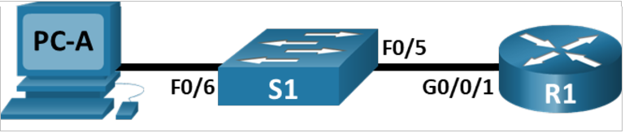
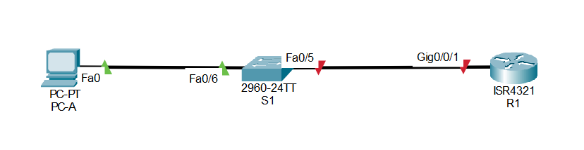
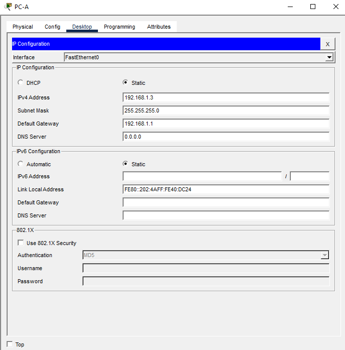

# Лабораторная работа №5. Доступ к сетевым устройствам по протоколу SSH.

## Топология



## Таблица адресации

|Устройство|Интерфейс|IP-адрес|маска подсети|Шлюз по умолчанию|
|----------|---------|--------|-------------|-----------------|
|R1|G0/0/1|192.168.1.1|255.255.25.0|-|
|S1|VLAN1|192.168.1.11|255.255.255.0|192.168.1.1|
|PC-A|NIC|192.168.1.3|255.255.255.0|192.168.1.1|

## Задачи

 - Часть 1. Настройка основных параметров устройства.

 - Часть 2. Настройка маршрутизатора для доступа по протоколу SSH

 - Часть 3. Настройка коммутатора для доступа по протоколу SSH

 - Часть 4. SSH через интерфейс командной строки (CLI) коммутатора


## Выполнение

### Часть 1

Создадим сеть согласно топологии и настроим основные параметры устройств.



После инициализации и перезагрузки коммутатора и маршрутизатора настроим основные параметры маршрутизатора.

 - Отключим поиск DNS чтобы предотвратить опытки маршрутизатора неверно преобразовывать введенные команды таким образом, как будто они являются именами узлов.
 - Назначим `class` в качестве зашифрованного пароля привилегированного режима EXEC.
 - Назначим `cisco` в качестве пароля консоли и включите вход в систему по паролю
 - Назначим `cisco` в качестве пароля VTY и включите вход в систему по паролю.
 - зашифруем открытые пароли
 - Создадим баннер, который предупреждает о запрете несанкционированного доступа.
 - Настроим  и активируем интерфейс G0/0/1, используя информацию, приведенную в таблице адресации.
 - Сохраните текущую конфигурацию в файл загрузочной конфигурации.

```
Router>en
Router#conf t

Router(config)#no ip domain-lookup

Router(config)#enable secret class

Router(config)#line console 0
Router(config-line)#password cisco
Router(config-line)#login
Router(config-line)#exit

Router(config)#line vty 0 15
Router(config-line)#password cisco
Router(config-line)#login
Router(config-line)#exit

Router(config)#banner motd c
Enter TEXT message.  End with the character 'c'.
!!!!!!!!!!!!!!!!!!!!!!!!!!!!!!!!!!!!!!!!!!!!!!!!!!!!!!!!!!!
!!!!!!!!!!!!!!UNAUTHORIZED ACCESS PROHIBITED!!!!!!!!!!!!!!!
!!!!!!!!!!!!!!UNAUTHORIZED ACCESS PROHIBITED!!!!!!!!!!!!!!!
!!!!!!!!!!!!!!UNAUTHORIZED ACCESS PROHIBITED!!!!!!!!!!!!!!!
!!!!!!!!!!!!!!UNAUTHORIZED ACCESS PROHIBITED!!!!!!!!!!!!!!!
!!!!!!!!!!!!!!UNAUTHORIZED ACCESS PROHIBITED!!!!!!!!!!!!!!!
!!!!!!!!!!!!!!!!!!!!!!!!!!!!!!!!!!!!!!!!!!!!!!!!!!!!!!!!!!! c

Router(config)#service password-encryption

Router(config)#int gi 0/0/1
Router(config-if)#no shutdown
Router(config-if)#ip address 192.168.1.1 255.255.255.0
Router(config-if)#end

Router#copy running-config startup-config 
Destination filename [startup-config]? 
Building configuration...
[OK]
```

Настроим, IP-адрес, маску подсети и шлюз по умолчанию для PC-A.



Проверим подключение, направив эхо-запрос маршрутизатору.

```
C:\>ping 192.168.1.1

Pinging 192.168.1.1 with 32 bytes of data:

Reply from 192.168.1.1: bytes=32 time=1ms TTL=255
Reply from 192.168.1.1: bytes=32 time<1ms TTL=255
Reply from 192.168.1.1: bytes=32 time<1ms TTL=255
Reply from 192.168.1.1: bytes=32 time<1ms TTL=255

Ping statistics for 192.168.1.1:
    Packets: Sent = 4, Received = 4, Lost = 0 (0% loss),
Approximate round trip times in milli-seconds:
    Minimum = 0ms, Maximum = 1ms, Average = 0ms
```

### Часть 2

Зададим имя, домен для маршрутизатора и после этого сгенерируем ключ шифрования с указанием его длины.
Обязательно сначала задать имя устройство и домен так как они используются при генерации ключа шифрования.


```
Router(config)#hostname R1

R1(config)#ip domain-name randomdomain

R1(config)#crypto key generate rsa general-keys modulus 2048
The name for the keys will be: R1.randomdomain

% The key modulus size is 2048 bits
% Generating 2048 bit RSA keys, keys will be non-exportable...[OK]
*Mar 1 0:17:28.296: %SSH-5-ENABLED: SSH 1.99 has been enabled
```

Из вывода команды мы видим что используется SSH версии 1.99.
Для обеспечения большей безопасности можно использовать версию 2

```
R1(config)#ip ssh version 2
```

Создадим пользователя в локальной базе учётных данных.
В качестве логина будет использовано admin и Adm1nP @55 в качестве пароля.

```
R1(config)#username admin secret Adm1nP @55
```
Активируем протокол Telnet и SSH на линиях VTY и настроим проверку пользователей из локальной БД.

```
R1(config-line)#transport input ?
  all     All protocols
  none    No protocols
  ssh     TCP/IP SSH protocol
  telnet  TCP/IP Telnet protocol

R1(config-line)#transport input all

R1(config-line)#login local
```

Использован параметр `all` так как при поочерёдном использовании параметров `ssh` и `telnet`, и выводе информации о конфигурации отображается последний введённый способ входа. 

При использовании параметра `all` в конфиге соответствующей строки найти не удаётся что указывает на то что оба способа входа включены по умолчанию.

При введении `no transport input` команда будет идентична `transport input none`

Сохраним конфигурацию.

```
R1#copy running-config startup-config 
Destination filename [startup-config]? 
Building configuration...
[OK]
```

Проверим соединение по протоколу SSH

```
C:\>ssh
Cisco Packet Tracer PC SSH

Usage: SSH -l username target

C:\>ssh -l admin 192.168.1.1

Password: 


!!!!!!!!!!!!!!!!!!!!!!!!!!!!!!!!!!!!!!!!!!!!!!!!!!!!!!!!!!!
!!!!!!!!!!!!!!UNAUTHORIZED ACCESS PROHIBITED!!!!!!!!!!!!!!!
!!!!!!!!!!!!!!UNAUTHORIZED ACCESS PROHIBITED!!!!!!!!!!!!!!!
!!!!!!!!!!!!!!UNAUTHORIZED ACCESS PROHIBITED!!!!!!!!!!!!!!!
!!!!!!!!!!!!!!UNAUTHORIZED ACCESS PROHIBITED!!!!!!!!!!!!!!!
!!!!!!!!!!!!!!UNAUTHORIZED ACCESS PROHIBITED!!!!!!!!!!!!!!!
!!!!!!!!!!!!!!!!!!!!!!!!!!!!!!!!!!!!!!!!!!!!!!!!!!!!!!!!!!! 

R1>
```

### Часть 3

Настроим основныепараметры коммутатора. В отличии от R1, на S1 пароль будет короче на один символ так как отсутствует пробел на пароле от S1.

```
Switch(config)#no ip domain-lookup
Switch(config)#
Switch(config)#enable secret class
Switch(config)#

Switch(config)#line console 0
Switch(config-line)#
Switch(config-line)#password cisco
Switch(config-line)#
Switch(config-line)#login
Switch(config-line)#
Switch(config-line)#exit
Switch(config)#

Switch(config)#line vty 0 15
Switch(config-line)#
Switch(config-line)#password cisco
Switch(config-line)#
Switch(config-line)#login
Switch(config-line)#
Switch(config-line)#exit

Switch(config)#banner motd c
Enter TEXT message.  End with the character 'c'.

!!!!!!!!!!!!!!!!!!!!!!!!!!!!!!!!!!!!!!!!!!!!!!!!!!!!!!!!!!!
!!!!!!!!!!!!!!UNAUTHORIZED ACCESS PROHIBITED!!!!!!!!!!!!!!!
!!!!!!!!!!!!!!UNAUTHORIZED ACCESS PROHIBITED!!!!!!!!!!!!!!!
!!!!!!!!!!!!!!UNAUTHORIZED ACCESS PROHIBITED!!!!!!!!!!!!!!!
!!!!!!!!!!!!!!UNAUTHORIZED ACCESS PROHIBITED!!!!!!!!!!!!!!!
!!!!!!!!!!!!!!UNAUTHORIZED ACCESS PROHIBITED!!!!!!!!!!!!!!!
!!!!!!!!!!!!!!!!!!!!!!!!!!!!!!!!!!!!!!!!!!!!!!!!!!!!!!!!!!! c

Switch(config)#service password-encryption
Switch(config)#

Switch(config)#ip default-gateway 192.168.1.1
Switch(config)#

Switch(config)#int vlan 1
Switch(config-if)#
Switch(config-if)#no shutdown
Switch(config-if)#
Switch(config-if)#ip address 192.168.1.11 255.255.255.0
%LINK-3-UPDOWN: Interface Vlan1, changed state to down

%LINEPROTO-5-UPDOWN: Line protocol on Interface Vlan1, changed state to up

Switch(config-if)#end
Switch#
%SYS-5-CONFIG_I: Configured from console by console

Switch#copy running-config startup-config 
Destination filename [startup-config]? 
Building configuration...
[OK]
Switch#
```
Настроим на коммутаторе соединение по SSH

```
Switch#conf t
Enter configuration commands, one per line.  End with CNTL/Z.
Switch(config)#

Switch(config)#hostname S1
S1(config)#

S1(config)#ip domain-name randomdomain
S1(config)#

S1(config)#crypto key generate rsa general-keys modulus 2048
The name for the keys will be: S1.randomdomain

% The key modulus size is 2048 bits
% Generating 2048 bit RSA keys, keys will be non-exportable...[OK]
*Mar 1 2:38:16.792: %SSH-5-ENABLED: SSH 1.99 has been enabled
S1(config)#

S1(config)#ip ssh version 2
S1(config)#

S1(config)#username admin secret Adm1nP@55
S1(config)#

S1(config)#line vty 0 15
S1(config-line)#
S1(config-line)#transport input all
S1(config-line)#
S1(config-line)#login local
S1(config-line)#
S1(config-line)#end
S1#

S1#copy running-config startup-config
%SYS-5-CONFIG_I: Configured from console by console

Destination filename [startup-config]? 
Building configuration...
[OK]
```

установим с коммутатором соединение по SSH.

```
C:\>ssh -l admin 192.168.1.11

Password: 


!!!!!!!!!!!!!!!!!!!!!!!!!!!!!!!!!!!!!!!!!!!!!!!!!!!!!!!!!!!
!!!!!!!!!!!!!!UNAUTHORIZED ACCESS PROHIBITED!!!!!!!!!!!!!!!
!!!!!!!!!!!!!!UNAUTHORIZED ACCESS PROHIBITED!!!!!!!!!!!!!!!
!!!!!!!!!!!!!!UNAUTHORIZED ACCESS PROHIBITED!!!!!!!!!!!!!!!
!!!!!!!!!!!!!!UNAUTHORIZED ACCESS PROHIBITED!!!!!!!!!!!!!!!
!!!!!!!!!!!!!!UNAUTHORIZED ACCESS PROHIBITED!!!!!!!!!!!!!!!
!!!!!!!!!!!!!!!!!!!!!!!!!!!!!!!!!!!!!!!!!!!!!!!!!!!!!!!!!!! 

S1>
```

Установим  коммутатора S1 соединение с маршрутизатором R1 по протоколу SSH

```
S1#ssh ?
  -l  Log in using this user name
  -v  Specify SSH Protocol Version

S1#ssh -l ?
  WORD  Login name

S1#ssh -l admin ?
  -v    Specify SSH Protocol Version
  WORD  IP address or hostname of a remote system

S1#ssh -l admin 192.168.1.1

Password: 


!!!!!!!!!!!!!!!!!!!!!!!!!!!!!!!!!!!!!!!!!!!!!!!!!!!!!!!!!!!
!!!!!!!!!!!!!!UNAUTHORIZED ACCESS PROHIBITED!!!!!!!!!!!!!!!
!!!!!!!!!!!!!!UNAUTHORIZED ACCESS PROHIBITED!!!!!!!!!!!!!!!
!!!!!!!!!!!!!!UNAUTHORIZED ACCESS PROHIBITED!!!!!!!!!!!!!!!
!!!!!!!!!!!!!!UNAUTHORIZED ACCESS PROHIBITED!!!!!!!!!!!!!!!
!!!!!!!!!!!!!!UNAUTHORIZED ACCESS PROHIBITED!!!!!!!!!!!!!!!
!!!!!!!!!!!!!!!!!!!!!!!!!!!!!!!!!!!!!!!!!!!!!!!!!!!!!!!!!!! 

R1>
```

Вернёмся к коммуитатору S1 не закрывая сеанса SSH.

Для этого введём комбинацию `Ctrl+Shift+6`, отпустим `Ctrl+Shift+6` и нажмём `x`

Увидим следующее:

```
R1>
R1>
R1>
R1>
R1>
S1#
```

Вернёмся к сеансу SSH на R1 не закрывая сеанса с S1

Для этого нажмём `Enter` в пустой комансной строке и после сообщения о возврате к сессии на R1 ещё раз нажмём `Enter`

Увидим следующее:

```
S1#
S1#
[Resuming connection 1 to 192.168.1.1 ... ]

R1>
```

Для завершения сеанса введём `exit`.

```
R1>exit

[Connection to 192.168.1.1 closed by foreign host]
S1#
```
