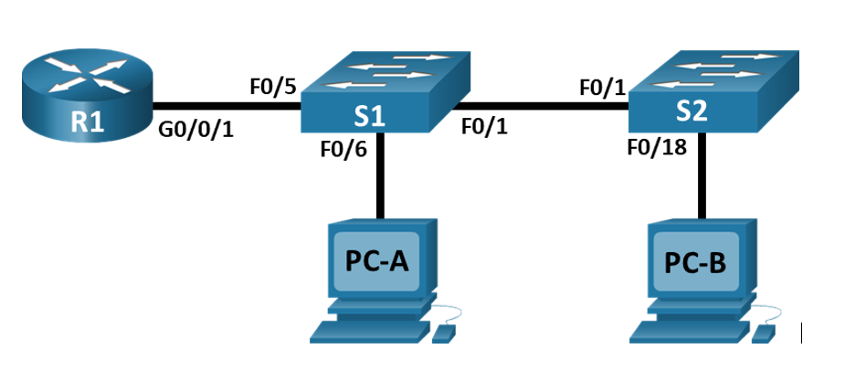
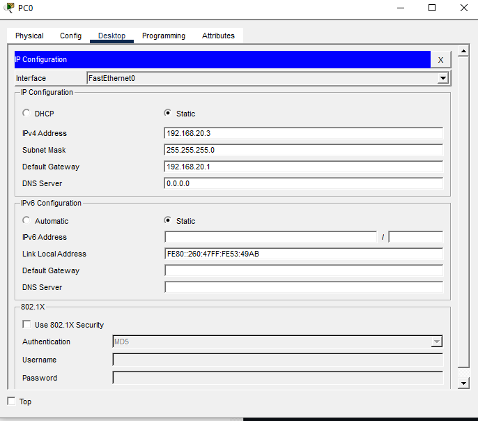
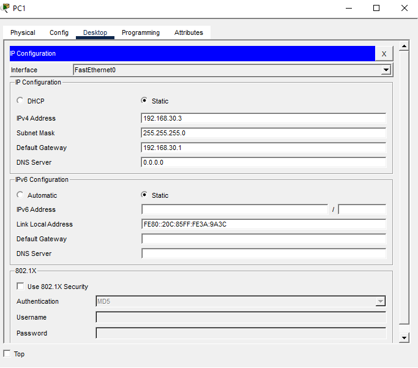

# Лабораторная работа №6.

## Топология



## Таблица адресации

|Устройство|Интерфейс|IP-адрес|маска подсети|Шлюз по умолчанию|
|----------|---------|--------|-------------|-----------------|
|R1|G0/0/1.10|192.168.10.1|255.255.255.0|-|
| |G0/0/1.20|192.168.20.1|255.255.255.0|-|
| |G0/0/1.30|192.168.30.1|255.255.255.0|-|
| |G0/0/1.1000|-|-|-|
|S1|VLAN 10|192.168.10.11|255.255.255.0|192.168.10.1|
|S2|VLAN 10|192.168.10.12|255.255.255.0|192.168.10.1|
|PC-A|NIC|192.168.20.3|255.255.255.0|192.168.20.1|
|PC-B|NIC|192.168.30.3|255.255.255.0|192.168.30.1|

## Таблица VLAN

|VLAN|Имя|Назначенный интерфейс|
|----|---|---------------------|
|10|Управление|S1: VLAN 10|
| | |S:2 VLAN 10|
|20|Sales|S1: F0/6|
|30|Operations|S2: F0/18|
|999|Parking_Lot|C:1 F0/2-4, F0/7-24, G0/1-2|
| | |C2: F0/2-17, F0/19-24, G0/1-2|
|1000|Собственная|-|

## Задачи

- Создание сети и настройка основных параметров устройства

- Создание сетей VLAN и назначение портов коммутатора

- Настройка транка 802.1Q между коммутаторами

- Настройка межвлановой маршрутизации

- Проверка межвлановой маршрутизации

## Выполнение

- Создадим сеть согласно топологии и гастроим базовые параметры маршрутизатора.

```
Router>en

Router#conf t

Router(config)#hostname R1

R1(config)#no ip domain-lookup

R1(config)#enable secret class

R1(config)#line con 0

R1(config-line)#password cisco

R1(config-line)#login

R1(config-line)#exit

R1(config-line)#exit

R1(config)#line vty 0 15

R1(config-line)#password cisco

R1(config-line)#login

R1(config-line)#exit

R1(config)#service password-encryption

R1(config)#banner motd c Nesanktsionirovanniy dostup zapreschyon c

R1(config)#ex

R1#clock set 10:00:00 20 May 2026

R1#copy running-config startup-config 
Destination filename [startup-config]? 
Building configuration...
[OK]

```
- Настроим базовые параметры коммутаторов. Настройки будут одинаковыми за исключением имени и в большинстве случаев времени если не используется ntp сервер.

```
Switch>en

Switch#conf t

Switch(config)#hostname S1

S1(config)#no ip domain-lookup

S1(config)#enable secret class

S1(config)#line con 0

S1(config-line)#password class

S1(config-line)#login

S1(config-line)#exit

S1(config)#line vty 0 15

S1(config-line)#password cisco

S1(config-line)#login

S1(config-line)#exit

S1(config)#service password-encryption

S1(config)#banner motd c Nesanktsionirovanniy dostup zapreschyon c

```

не имея часов можно проверить время на коммутаторе с настроенными часами

```
R1#show clock

10:12:57.597 UTC Wed May 20 2026

```

- настроим время на часах коммутаторов и сохраним конфигурацию

```
S1#clock set 10:12:57 20 May 2026

S1#copy running-config startup-config 
Destination filename [startup-config]? 
Building configuration...
[OK]

```

если бы использовался ntp сервер, то в простейшем выиде это навстройка бы так

задаётся адрес ntp сервера, часовой пояс

```

S1(config)#ntp server 192.168.100.100

S1(config)# clock timezone MSK 3

S1(config)# end

S1# copy running-config startup-config

```

- После настройки коммутаторов, зададим настройки ip адреса для PC-A и PC-B.





- Создадим и назовём необходимые VLAN на каждом коммутаторе.

S1

```
S1(config)#vlan 10
S1(config-vlan)#name Upravlenie
S1(config-vlan)#ex

S1(config)#vlan 20
S1(config-vlan)#name Sales
S1(config-vlan)#ex

S1(config)#vlan 30
S1(config-vlan)#name Operations
S1(config-vlan)#ex

S1(config)#vlan 999
S1(config-vlan)#name Parking_Lot
S1(config-vlan)#ex

S1(config)#Vlan 1000
S1(config-vlan)#name Sobstvennaya
S1(config)#exit
```

S2

```
S2(config)#vlan 10
S2(config-vlan)#name Upravlenie
S2(config-vlan)#ex

S2(config)#vlan 20
S2(config-vlan)#name Sales
S2(config-vlan)#ex

S2(config)#vlan 30
S2(config-vlan)#name Operations
S2(config-vlan)#ex

S2(config)#vlan 999
S2(config-vlan)#name Parking_Lot
S2(config-vlan)#ex

S2(config)#Vlan 1000
S2(config-vlan)#name Sobstvennaya
S2(config)#ex
```

- Настроим интерфейс управления и шлюз по умолчанию на каждом коммутаторе

S1

```
S1(config)#int vl 10
S1(config-if)#
%LINK-5-CHANGED: Interface Vlan10, changed state to up
S1(config-if)#ip address 192.168.10.11 255.255.255.0
S1(config-if)#ex
S1(config)#ip default-gateway 192.168.10.1
```
S2

```
S2(config)#int vl 10
S2(config-if)#
%LINK-5-CHANGED: Interface Vlan10, changed state to up
S2(config-if)#ip address 192.168.10.12 255.255.255.0
S2(config-if)#ex
S2(config)#ip default-gateway 192.168.10.1
```

- Назначим все неиспользуемые порты коммутатора VLAN Parking_Lot, настроим их для статического режима доступа и административно деактивируем их.

S1

```
S1(config)#interface range fastEthernet 0/2-4
S1(config-if-range)#shutdown 
S1(config-if-range)#switchport access vlan 999
S1(config-if-range)#switchport mode access 
S1(config-if-range)# ex

S1(config)#interface range fastEthernet 0/7-24
S1(config-if-range)#shutdown
S1(config-if-range)#switchport access vlan 999
S1(config-if-range)#switchport mode access 
S1(config-if-range)#ex

S1(config)#interface range gi0/1-2
S1(config-if-range)#shutdown 
S1(config-if-range)#switchport access vlan 999
S1(config-if-range)#switchport mode access
```

S2

```
S2(config)#interface range fastEthernet 0/2-17
S2(config-if-range)#shutdown
S2(config-if-range)#switchport access vlan 999
S2(config-if-range)#switchport mode access
S2(config-if-range)#ex

S2(config)#interface range fastEthernet 0/19-24
S2(config-if-range)#shutdown
S2(config-if-range)#switchport access vlan 999
S2(config-if-range)#switchport mode access
S2(config-if-range)#ex

S2(config)#interface range gigabitEthernet 0/1-2
S2(config-if-range)#shutdown
S2(config-if-range)#switchport access vlan 999
S2(config-if-range)#switchport mode access
```

 - Назначим используемые порты соответствующей VLAN и настроим их для режима статического доступа и проверим корректность назначения интерфейсов.

S1

```
S1(config)# interface fastEthernet 0/6
S1(config-if)#description Sales
S1(config-if)#switchport mode access 
S1(config-if)#switchport access vlan 20
```

```
S1(config-if)#do sho vl br

VLAN Name                             Status    Ports
---- -------------------------------- --------- -------------------------------
1    default                          active    Fa0/1, Fa0/5
10   Upravlenie                       active    
20   Sales                            active    Fa0/6
999  Parking_Lot                      active    Fa0/2, Fa0/3, Fa0/4, Fa0/7
                                                Fa0/8, Fa0/9, Fa0/10, Fa0/11
                                                Fa0/12, Fa0/13, Fa0/14, Fa0/15
                                                Fa0/16, Fa0/17, Fa0/18, Fa0/19
                                                Fa0/20, Fa0/21, Fa0/22, Fa0/23
                                                Fa0/24, Gig0/1, Gig0/2
1000 Sobstvennaya                     active    
1002 fddi-default                     active    
1003 token-ring-default               active    
1004 fddinet-default                  active    
1005 trnet-default                    active 
```

S2

```
S2(config)#interface fastEthernet 0/18
S2(config-if)#description Operations
S2(config-if)#switchport mode access
S2(config-if)#switchport acc vl 30
```

```
S2(config-if)#do sho vl br

VLAN Name                             Status    Ports
---- -------------------------------- --------- -------------------------------
1    default                          active    Fa0/1
10   Upravlenie                       active      
30   Operations                       active    Fa0/18
999  Parking_Lot                      active    Fa0/2, Fa0/3, Fa0/4, Fa0/5
                                                Fa0/6, Fa0/7, Fa0/8, Fa0/9
                                                Fa0/10, Fa0/11, Fa0/12, Fa0/13
                                                Fa0/14, Fa0/15, Fa0/16, Fa0/17
                                                Fa0/19, Fa0/20, Fa0/21, Fa0/22
                                                Fa0/23, Fa0/24, Gig0/1, Gig0/2
1000 Sobstvennaya                     active    
1002 fddi-default                     active    
1003 token-ring-default               active    
1004 fddinet-default                  active    
1005 trnet-default                    active    
```

- Настроим транкинг на интерфейсе F0/1 коммутаторов и проверим настройки

S1

```
S1(config)#int fa0/1

S1(config-if)#descr Uplink_to_S2

S1(config-if)#switchport mode trunk

S1(config-if)#switchport trunk native vlan 1000
S1(config-if)#%SPANTREE-2-RECV_PVID_ERR: Received BPDU with inconsistent peer vlan id 1 on FastEthernet0/1 VLAN1000.

%SPANTREE-2-BLOCK_PVID_LOCAL: Blocking FastEthernet0/1 on VLAN1000. Inconsistent local vlan.

S1(config-if)#switchport trunk allowed vlan 1000
S1(config-if)#switchport trunk allowed vlan add 10
S1(config-if)#switchport trunk allowed vlan add 20
S1(config-if)#switchport trunk allowed vlan add 30

S1#sho run
!
interface FastEthernet0/1
 description Uplink_to_S2
 switchport trunk native vlan 1000
 switchport trunk allowed vlan 10,20,30,1000
 switchport mode trunk
!
```
Для S2 настройки вланов идентичны.

- настроим интерфейс F0/5 на S1 и проверим настройки

```
S1(config)#interface fastEthernet 0/5

S1(config-if)#description Uplink_to_R1

S1(config-if)#switchport mode trunk

S1(config-if)#switchport trunk native vlan 1000

S1(config-if)#switchport trunk allowed vlan 1000
S1(config-if)#switchport trunk allowed vlan add 10
S1(config-if)#switchport trunk allowed vlan add 20
S1(config-if)#switchport trunk allowed vlan add 30

S1(config-if)#end

S1#copy running-config startup-config 
Destination filename [startup-config]? 
Building configuration...
[OK]

S1#sho run
!
interface FastEthernet0/5
 description Uplink_to_R1
 switchport trunk native vlan 1000
 switchport trunk allowed vlan 10,20,30,1000
 switchport mode trunk
!
```

