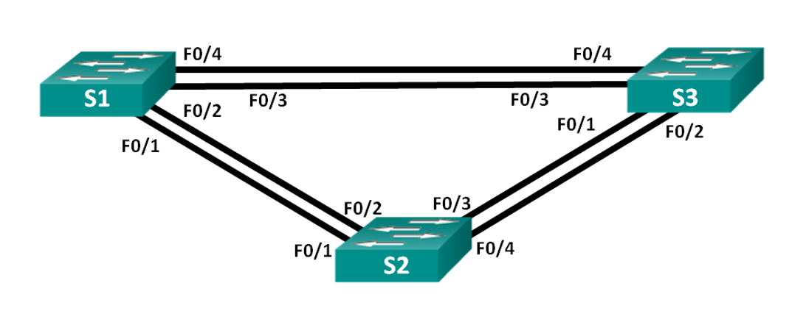
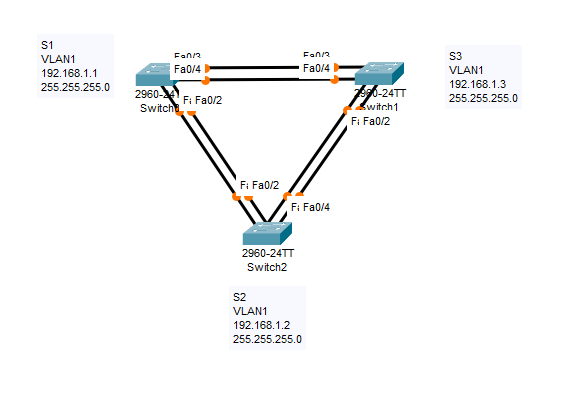

# Лабораторная работа №7. Развертывание коммутируемой сети с резервными каналами

## Топология



## Таблица адресации
|Устройство|Интерфейс|IP-адрес|Маска подсети|
|----------|---------|--------|-------------|
|S1|VLAN1|192.168.1.1|255.255.255.0|
|S2|VLAN1|192.168.1.2|255.255.255.0|
|S3|VLAN1|192.168.1.3|255.255.255.0|

## Задачи
- Часть 1. Создание сети и настройка основных параметров устройства
- Часть 2. Выбор корневого моста
- Часть 3. Наблюдение за процессом выбора протоколом STP порта, исходя из стоимости портов
- Часть 4. Наблюдение за процессом выбора протоколом STP порта, исходя из приоритета портов

## Выполнение

- Создадим cеть и настроим основные параметры.



S1

```
Switch>en
Switch#conf t

Switch(config)#no ip domain-lookup
Switch(config)#hostname S1
S1(config)#enable secret class

S1(config)#line con 0
S1(config-line)#password cisco
S1(config-line)#logging synchronous
S1(config-line)#login
S1(config-line)#exit

S1(config)#line vty 0 15
S1(config-line)#password cisco
S1(config-line)#login
S1(config-line)#exit

S1(config)#banner motd c
Enter TEXT message.  End with the character 'c'.
!!!!!!!!!!!!!!!!!!!!!!!!!!!!!!!!!!!!!!!!!!!!!!!!!!!!!!!!!!!
!!!!!!!!!!!!!!UNAUTHORIZED ACCESS PROHIBITED!!!!!!!!!!!!!!!
!!!!!!!!!!!!!!UNAUTHORIZED ACCESS PROHIBITED!!!!!!!!!!!!!!!
!!!!!!!!!!!!!!UNAUTHORIZED ACCESS PROHIBITED!!!!!!!!!!!!!!!
!!!!!!!!!!!!!!UNAUTHORIZED ACCESS PROHIBITED!!!!!!!!!!!!!!!
!!!!!!!!!!!!!!UNAUTHORIZED ACCESS PROHIBITED!!!!!!!!!!!!!!!
!!!!!!!!!!!!!!!!!!!!!!!!!!!!!!!!!!!!!!!!!!!!!!!!!!!!!!!!!!! c

S1(config)#service password-encryption
S1(config)#interface vlan 1
S1(config-if)#ip address 192.168.1.1 255.255.255.0
S1(config-if)#no shutdown
S1(config-if)#end

S1#copy running-config startup-config
Destination filename [startup-config]? 
Building configuration...
[OK]
```

S2

```
Switch>en
Switch#conf t
Enter configuration commands, one per line.  End with CNTL/Z.
Switch(config)#no ip domain-lookup
Switch(config)#hostname S2
S2(config)#enable secret class
S2(config)#line con 0
S2(config-line)#password cisco
S2(config-line)#logging synchronous
S2(config-line)#login
S2(config-line)#exit
S2(config)#line vty 0 15
S2(config-line)#password cisco
S2(config-line)#login
S2(config-line)#exit
S2(config)#banner motd c
Enter TEXT message.  End with the character 'c'.
!!!!!!!!!!!!!!!!!!!!!!!!!!!!!!!!!!!!!!!!!!!!!!!!!!!!!!!!!!!
!!!!!!!!!!!!!!UNAUTHORIZED ACCESS PROHIBITED!!!!!!!!!!!!!!!
!!!!!!!!!!!!!!UNAUTHORIZED ACCESS PROHIBITED!!!!!!!!!!!!!!!
!!!!!!!!!!!!!!UNAUTHORIZED ACCESS PROHIBITED!!!!!!!!!!!!!!!
!!!!!!!!!!!!!!UNAUTHORIZED ACCESS PROHIBITED!!!!!!!!!!!!!!!
!!!!!!!!!!!!!!UNAUTHORIZED ACCESS PROHIBITED!!!!!!!!!!!!!!!
!!!!!!!!!!!!!!!!!!!!!!!!!!!!!!!!!!!!!!!!!!!!!!!!!!!!!!!!!!! c

S2(config)#service password-encryption
S2(config)#interface vlan 1
S2(config-if)#ip address 192.168.1.2 255.255.255.0
S2(config-if)#no shutdown
S2(config-if)#end
S2#copy running-config startup-config
```
S3

```
Switch>en
Switch#conf t
Enter configuration commands, one per line.  End with CNTL/Z.
Switch(config)#no ip domain-lookup
Switch(config)#hostname S3
S3(config)#enable secret class
S3(config)#line con 0
S3(config-line)#password cisco
S3(config-line)#logging synchronous
S3(config-line)#login
S3(config-line)#exit
S3(config)#line vty 0 15
S3(config-line)#password cisco
S3(config-line)#login
S3(config-line)#exit
S3(config)#banner motd c
Enter TEXT message.  End with the character 'c'.
!!!!!!!!!!!!!!!!!!!!!!!!!!!!!!!!!!!!!!!!!!!!!!!!!!!!!!!!!!!
!!!!!!!!!!!!!!UNAUTHORIZED ACCESS PROHIBITED!!!!!!!!!!!!!!!
!!!!!!!!!!!!!!UNAUTHORIZED ACCESS PROHIBITED!!!!!!!!!!!!!!!
!!!!!!!!!!!!!!UNAUTHORIZED ACCESS PROHIBITED!!!!!!!!!!!!!!!
!!!!!!!!!!!!!!UNAUTHORIZED ACCESS PROHIBITED!!!!!!!!!!!!!!!
!!!!!!!!!!!!!!UNAUTHORIZED ACCESS PROHIBITED!!!!!!!!!!!!!!!
!!!!!!!!!!!!!!!!!!!!!!!!!!!!!!!!!!!!!!!!!!!!!!!!!!!!!!!!!!! c

S3(config)#service password-encryption
S3(config)#interface vlan 1
S3(config-if)#ip address 192.168.1.3 255.255.255.0
S3(config-if)#no shutdown
S3(config-if)#end
S3#copy running-config startup-config
```
проверим связность

```
S1#ping 192.168.1.2
Type escape sequence to abort.
Sending 5, 100-byte ICMP Echos to 192.168.1.2, timeout is 2 seconds:
..!!!
Success rate is 60 percent (3/5), round-trip min/avg/max = 0/0/0 ms
S1#ping 192.168.1.3
Type escape sequence to abort.
Sending 5, 100-byte ICMP Echos to 192.168.1.3, timeout is 2 seconds:
..!!!
Success rate is 60 percent (3/5), round-trip min/avg/max = 0/0/0 ms

S2#ping 192.168.1.1
Type escape sequence to abort.
Sending 5, 100-byte ICMP Echos to 192.168.1.1, timeout is 2 seconds:
!!!!!
Success rate is 100 percent (5/5), round-trip min/avg/max = 0/0/0 ms
S2#ping 192.168.1.3
Type escape sequence to abort.
Sending 5, 100-byte ICMP Echos to 192.168.1.3, timeout is 2 seconds:
..!!!
Success rate is 60 percent (3/5), round-trip min/avg/max = 0/0/0 ms

S3#ping 192.168.1.1
Type escape sequence to abort.
Sending 5, 100-byte ICMP Echos to 192.168.1.1, timeout is 2 seconds:
!!!!!
Success rate is 100 percent (5/5), round-trip min/avg/max = 0/0/0 ms
S3#ping 192.168.1.2
Type escape sequence to abort.
Sending 5, 100-byte ICMP Echos to 192.168.1.2, timeout is 2 seconds:
!!!!!
Success rate is 100 percent (5/5), round-trip min/avg/max = 0/0/0 ms
```

- Отключим все порты на коммутаторах, настроим подключенные кабелем порты в качестве транковых, и включими порты F0/2 и F0/4 на всех коммутаторах.

S1

```
S1(config)#interface range gigabitEthernet 0/1-2
S1(config-if-range)#shutdown
S1(config-if-range)#exit
S1(config)#interface range fastEthernet 0/1-24
S1(config-if-range)#shutdown 
S1(config-if-range)#exit
S1(config)#interface range fastEthernet 0/1-4
S1(config-if-range)#switchport mode trunk
S1(config-if-range)#exit
S1(config)#interface fastEthernet 0/2
S1(config-if)#no shutdown 
S1(config)#interface fastEthernet 0/4
S1(config-if)#no shutdown
```

S2

```
S2(config)#interface range gigabitEthernet 0/1-2
S2(config-if-range)#shutdown
S2(config-if-range)#exit
S2(config)#interface range fastEthernet 0/1-24
S2(config-if-range)#shutdown 
S2(config-if-range)#exit
S2(config)#interface range fastEthernet 0/1-4
S2(config-if-range)#switchport mode trunk
S2(config-if-range)#exit
S2(config)#interface fastEthernet 0/2
S2(config-if)#no shutdown 
S2(config)#interface fastEthernet 0/4
S2(config-if)#no shutdown
```

S3

```
S3(config)#interface range gigabitEthernet 0/1-2
S3(config-if-range)#shutdown
S3(config-if-range)#exit
S3(config)#interface range fastEthernet 0/1-24
S3(config-if-range)#shutdown 
S3(config-if-range)#exit
S3(config)#interface range fastEthernet 0/1-4
S3(config-if-range)#switchport mode trunk
S3(config-if-range)#exit
S3(config)#interface fastEthernet 0/2
S3(config-if)#no shutdown 
S3(config)#interface fastEthernet 0/4
S3(config-if)#no shutdown
```

- Отобразим даннне протокола spanning-tree

S1

```
S1#show spanning-tree 
VLAN0001
  Spanning tree enabled protocol ieee
  Root ID    Priority    32769
             Address     000D.BD20.58AD
             Cost        19
             Port        2(FastEthernet0/2)
             Hello Time  2 sec  Max Age 20 sec  Forward Delay 15 sec

  Bridge ID  Priority    32769  (priority 32768 sys-id-ext 1)
             Address     00D0.BCA9.455C
             Hello Time  2 sec  Max Age 20 sec  Forward Delay 15 sec
             Aging Time  20

Interface        Role Sts Cost      Prio.Nbr Type
---------------- ---- --- --------- -------- --------------------------------
Fa0/2            Root FWD 19        128.2    P2p
Fa0/4            Altn BLK 19        128.4    P2p
```

S2

```
S2#show spanning-tree 
VLAN0001
  Spanning tree enabled protocol ieee
  Root ID    Priority    32769
             Address     000D.BD20.58AD
             This bridge is the root
             Hello Time  2 sec  Max Age 20 sec  Forward Delay 15 sec

  Bridge ID  Priority    32769  (priority 32768 sys-id-ext 1)
             Address     000D.BD20.58AD
             Hello Time  2 sec  Max Age 20 sec  Forward Delay 15 sec
             Aging Time  20

Interface        Role Sts Cost      Prio.Nbr Type
---------------- ---- --- --------- -------- --------------------------------
Fa0/2            Desg FWD 19        128.2    P2p
Fa0/4            Desg FWD 19        128.4    P2p
```

S3

```
S3#sho spanning-tree 
VLAN0001
  Spanning tree enabled protocol ieee
  Root ID    Priority    32769
             Address     000D.BD20.58AD
             Cost        19
             Port        2(FastEthernet0/2)
             Hello Time  2 sec  Max Age 20 sec  Forward Delay 15 sec

  Bridge ID  Priority    32769  (priority 32768 sys-id-ext 1)
             Address     0050.0F6A.0575
             Hello Time  2 sec  Max Age 20 sec  Forward Delay 15 sec
             Aging Time  20

Interface        Role Sts Cost      Prio.Nbr Type
---------------- ---- --- --------- -------- --------------------------------
Fa0/2            Root FWD 19        128.2    P2p
Fa0/4            Desg FWD 19        128.4    P2p
```

- запишем роль и состояние активных портов

|Коммутатор|Мак-адрес коммутатора|Порт|Роль|Состояние|
|----------|---------------------|----|----|---------|
|S1|00:D0:BC:A9:45:5C|Fa0/2|Root|Forwarding|
|S1|00:D0:BC:A9:45:5C|Fa0/4|Alternate|Blocking|
|S2|00:0D:BD:20:58:AD|Fa0/2|Designated|Forwarding|
|S2|00:0D:BD:20:58:AD|Fa0/4|Designated|Forwarding|
|S3|00:50:0F:6A:05:75|Fa0/2|Root|Forwarding|
|S3|00:50:0F:6A:05:75|Fa0/4|Designated|Forwarding|
