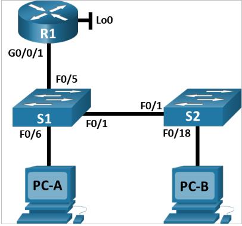

# Лабораторная работа №10. Конфигурация безопасности коммутатора.

## Топология



## Таблица адресации

|Устройство|Interface/Vlan|IP-адрес|Маска подсети|
|----------|--------------|--------|-------------|
|R1|G0/0/1|192.168.10.1|255.255.255.0|
| |Loopback 0 |10.10.1.1|255.255.255.0|
|S1|VLAN 10|192.168.10.201|255.255.255.0|
|S2|VLAN 10|192.168.10.202|255.255.255.0|
|PC-A|NIC|DHCP|255.255.255.0|
|PC-B|NIV|DHCP|255.255.255.0|

## Задачи
- Реализация магистральных соединений 802.1Q.
- Настройка портов доступа
- Безопасность неиспользуемых портов коммутатора
- Документирование и реализация функций безопасности порта.
- Реализовать безопасность DHCP snooping .
- Реализация PortFast и BPDU Guard
- Проверка сквозной связанности.

### Настройка маршрутизатора

```
enable
configure terminal
hostname R1
no ip domain lookup
ip dhcp excluded-address 192.168.10.1 192.168.10.9
ip dhcp excluded-address 192.168.10.201 192.168.10.202
ip dhcp relay informationtrust-all
ip dhcp pool Students
network 192.168.10.0 255.255.255.0
default-router 192.168.10.1
domain-name CCNA2.Lab-11.6.1
interface Loopback0
ip address 10.10.1.1 255.255.255.0
interface GigabitEthernet0/0/1
description Link to S1
ip address 192.168.10.1 255.255.255.0
no shutdown
line con 0
logging synchronous
exec-timeout 0 0
end
copy running-config startup-config
```

- Проверка конфигурации

```
R1#show ip interface brief
Interface              IP-Address      OK? Method Status                Protocol 
GigabitEthernet0/0/0   unassigned      YES NVRAM  administratively down down 
GigabitEthernet0/0/1   192.168.10.1    YES manual up                    up 
GigabitEthernet0/0/2   unassigned      YES NVRAM  administratively down down 
Loopback0              10.10.1.1       YES manual up                    up 
Vlan1                  unassigned      YES NVRAM  administratively down down
```

### Базовая настройка коммутаторов

- S1

```
enable
configure terminal
hostname S1
no ip domain-lookup
interface fastEthernet 0/5
description Link to R1
interface fastEthernet 0/6
description Link to PC-A
interface fastEthernet 0/1
description Trunk to S2
ip default-gateway 192.168.10.1
vlan 10
name Management
vlan 333
name Native
vlan 999
name ParkingLot
interface vlan 10
ip address 192.168.10.201 255.255.255.0
no shutdown
description Management SVI
end
copy running-config startup-config
```

- S2

```
enable
configure terminal
hostname S2
no ip domain-lookup
interface fastEthernet 0/1
description Trunk to S1
interface fastEthernet 0/18
description Link to PC-B
ip default-gateway 192.168.10.1
vlan 10
name Management
vlan 333
name Native
vlan 999
name ParkingLot
interface vlan 10
ip address 192.168.10.202 255.255.255.0
no shutdown
description Management SVI
end
copy running-config startup-config
```

## Настройка безопасности коммутаторов

### Релизация магистральных соединений 802.1Q и проверка 

- S1

```
interface fastEthernet 0/1
switchport trunk native vlan 333
switchport mode trunk
switchport nonegotiate
end
```

- S2

```
interface fastEthernet 0/1
switchport trunk native vlan 333
switchport mode trunk
switchport nonegotiate
```

- проверка

```
S1#show interface trunk
Port        Mode         Encapsulation  Status        Native vlan
Fa0/1       on           802.1q         trunking      333

Port        Vlans allowed on trunk
Fa0/1       1-1005

Port        Vlans allowed and active in management domain
Fa0/1       1,10,333,999

Port        Vlans in spanning tree forwarding state and not pruned
Fa0/1       1,10,333,999
```

```
S2#show interfaces trunk 
Port        Mode         Encapsulation  Status        Native vlan
Fa0/1       on           802.1q         trunking      333

Port        Vlans allowed on trunk
Fa0/1       1-1005

Port        Vlans allowed and active in management domain
Fa0/1       1,10,333,999

Port        Vlans in spanning tree forwarding state and not pruned
Fa0/1       1,10,333,999
```
### Настройка портов доступа и безопасность неиспользуемых портов

- S1

```
interface fastEthernet 0/5
switchport mode access
switchport access vlan 10
interface fastEthernet 0/6
switchport mode access
switchport access vlan 10
interface range fastEthernet 0/2-4, fastEthernet 0/7-24, gigabitEthernet 0/1-2
switchport access vlan 999
shutdown
```
- S2

```
interface fastEthernet 0/18
switchport mode access
switchport access vlan 10
interface range fastEthernet 0/2-17, fastEthernet 0/19-24, gigabitEthernet 0/1-2
switchport access vlan 999
shutdown
```

- Проверка

```
S1#show interfaces status
Port      Name               Status       Vlan       Duplex  Speed Type
Fa0/1     Trunk to S2        connected    trunk      a-full  a-100 10/100BaseTX
Fa0/2                        disabled 999        auto    auto  10/100BaseTX
Fa0/3                        disabled 999        auto    auto  10/100BaseTX
Fa0/4                        disabled 999        auto    auto  10/100BaseTX
Fa0/5     Link to R1         connected    10         a-full  a-100 10/100BaseTX
Fa0/6     Link to PC-A       connected    10         a-full  a-100 10/100BaseTX
Fa0/7                        disabled 999        auto    auto  10/100BaseTX
Fa0/8                        disabled 999        auto    auto  10/100BaseTX
Fa0/9                        disabled 999        auto    auto  10/100BaseTX
Fa0/10                       disabled 999        auto    auto  10/100BaseTX
Fa0/11                       disabled 999        auto    auto  10/100BaseTX
Fa0/12                       disabled 999        auto    auto  10/100BaseTX
Fa0/13                       disabled 999        auto    auto  10/100BaseTX
Fa0/14                       disabled 999        auto    auto  10/100BaseTX
Fa0/15                       disabled 999        auto    auto  10/100BaseTX
Fa0/16                       disabled 999        auto    auto  10/100BaseTX
Fa0/17                       disabled 999        auto    auto  10/100BaseTX
Fa0/18                       disabled 999        auto    auto  10/100BaseTX
Fa0/19                       disabled 999        auto    auto  10/100BaseTX
Fa0/20                       disabled 999        auto    auto  10/100BaseTX
Fa0/21                       disabled 999        auto    auto  10/100BaseTX
Fa0/22                       disabled 999        auto    auto  10/100BaseTX
Fa0/23                       disabled 999        auto    auto  10/100BaseTX
Fa0/24                       disabled 999        auto    auto  10/100BaseTX
Gig0/1                       disabled 999        auto    auto  10/100/1000BaseTX
Gig0/2                       disabled 999        auto    auto  10/100/1000BaseTX
```

```
S2#show interfaces status 
Port      Name               Status       Vlan       Duplex  Speed Type
Fa0/1     Trunk to S1        connected    trunk      a-full  a-100 10/100BaseTX
Fa0/2                        disabled 999        auto    auto  10/100BaseTX
Fa0/3                        disabled 999        auto    auto  10/100BaseTX
Fa0/4                        disabled 999        auto    auto  10/100BaseTX
Fa0/5                        disabled 999        auto    auto  10/100BaseTX
Fa0/6                        disabled 999        auto    auto  10/100BaseTX
Fa0/7                        disabled 999        auto    auto  10/100BaseTX
Fa0/8                        disabled 999        auto    auto  10/100BaseTX
Fa0/9                        disabled 999        auto    auto  10/100BaseTX
Fa0/10                       disabled 999        auto    auto  10/100BaseTX
Fa0/11                       disabled 999        auto    auto  10/100BaseTX
Fa0/12                       disabled 999        auto    auto  10/100BaseTX
Fa0/13                       disabled 999        auto    auto  10/100BaseTX
Fa0/14                       disabled 999        auto    auto  10/100BaseTX
Fa0/15                       disabled 999        auto    auto  10/100BaseTX
Fa0/16                       disabled 999        auto    auto  10/100BaseTX
Fa0/17                       disabled 999        auto    auto  10/100BaseTX
Fa0/18    Link to PC-B       connected    10         a-full  a-100 10/100BaseTX
Fa0/19                       disabled 999        auto    auto  10/100BaseTX
Fa0/20                       disabled 999        auto    auto  10/100BaseTX
Fa0/21                       disabled 999        auto    auto  10/100BaseTX
Fa0/22                       disabled 999        auto    auto  10/100BaseTX
Fa0/23                       disabled 999        auto    auto  10/100BaseTX
Fa0/24                       disabled 999        auto    auto  10/100BaseTX
Gig0/1                       disabled 999        auto    auto  10/100/1000BaseTX
Gig0/2                       disabled 999        auto    auto  10/100/1000BaseTX
```

### Документирование и реализация функций безопасности порта

- конфигурация безопасности порта по умолчанию

|Функция|Настройка по умолчанию|
|-------|----------------------|
|Защита портов|Disabled|
|Максимальное количество записей MAC-адресов|1|
|Режим проверки на нарушение безопасности|Shutdown|
|Aging Time|0 mins|
|Aging Type|Absolute|
|Secure Static Address Aging|Disabled|
|Sticky MAC Address|0|

- настройка port-security на S1

```
interface fastEthernet 0/6
switchport port-security
switchport port-security maximum 3
switchport port-security violation restrict
switchport port-security aging time 60
```

в cisco packet tracer не поддерживает изменение aging type

```
S1(config-if)#switchport port-security aging ?
  time  Port-security aging time
Switch(config-if)#switchport port-security aging ?
  time  Port-security aging time
 ```
