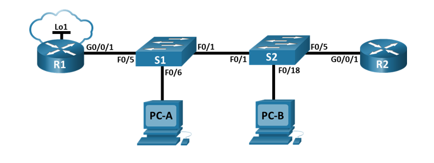
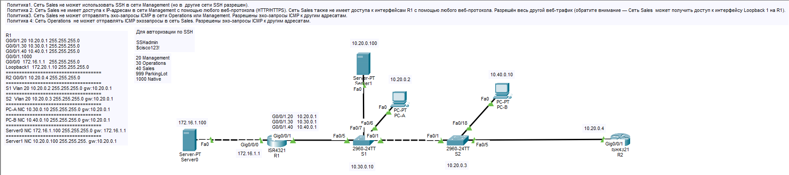
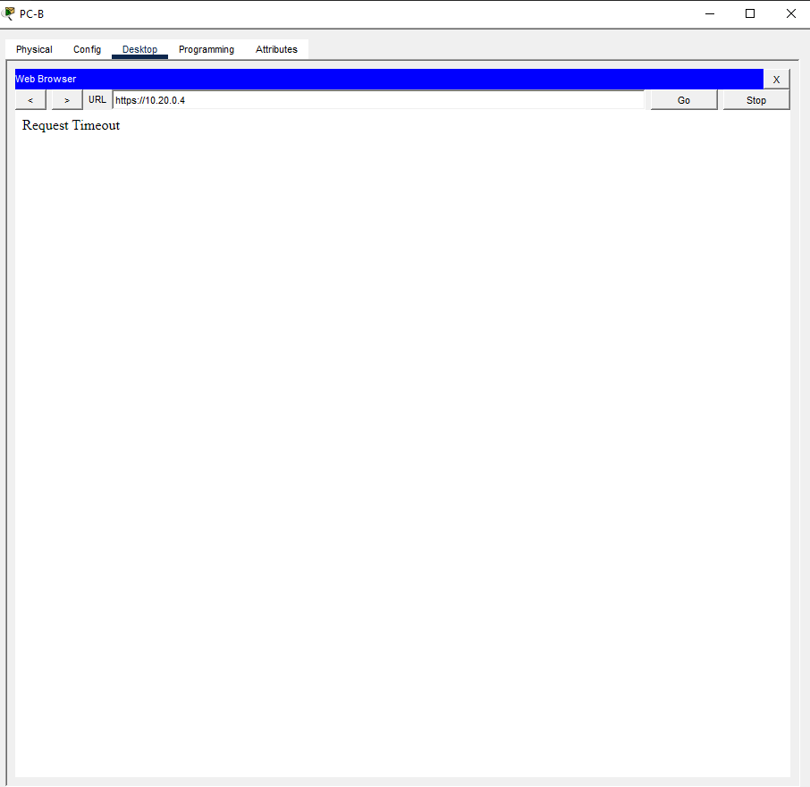
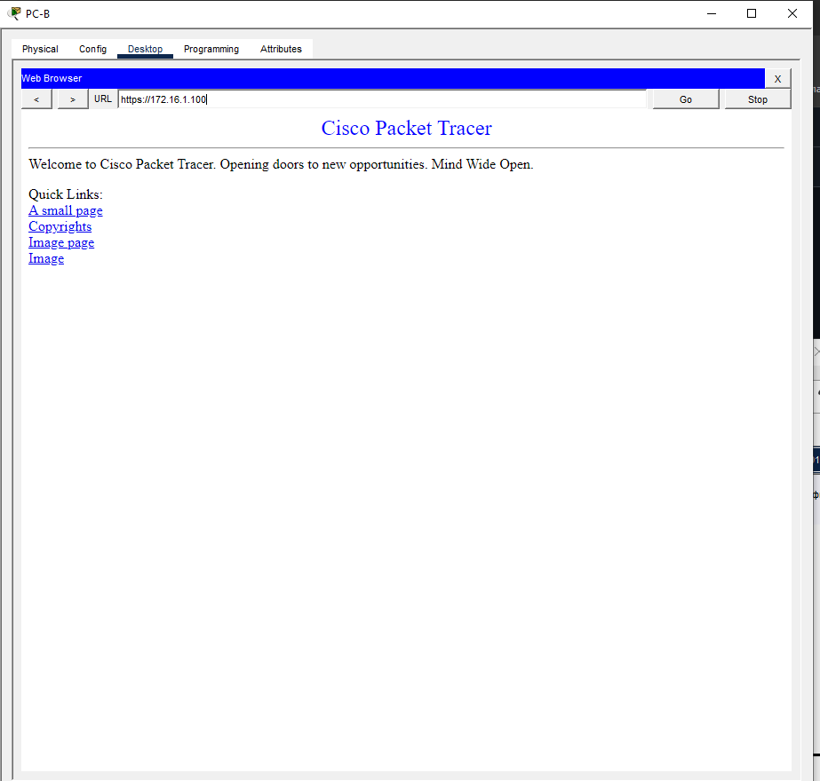

# Лабораторная работа №12. Настройка и проверка расширенных списков контроля доступа.

## Топология



## Таблица адресации.

|Устройство|Интерфейс|IP-адрес|Маска подсети|Шлюз по умолчанию|
|----------|---------|--------|-------------|-----------------|
|R1|G0/0/1|-|-|-|
| |G0/0/1.20|10.20.0.1|255.255.255.0|-|
| |G0/0/1.30|10.30.0.1|255.255.255.0|-|
| |G0/0/1.40|10.40.0.1|255.255.255.0|-|
| |G0/0/1.1000|-|-|-|
| |Loopback1|172.16.1.1|255.255.255.0|-|
|R2|G0/0/1|10.20.0.4|255.255.255.0|-|
|S1|VLAN 20|10.20.0.2|255.255.255.0|10.20.0.1|
|S2|VLAN 20|10.20.0.3|255.255.255.0|10.20.0.1|
|PC-A|NIC|10.30.0.10|255.255.255.0|10.30.0.1|
|PC-B|NIC|10.40.0.10|255.255.255.0|10.40.0.1|

## Таблица VLAN

|VLAN|Имя|Интерфейс|
|----|---|---------|
|20|Management|S2: F0/5|
|30|Operations|S1: F0/6|
|40|Sales|S2: F0/18|
|999|ParkingLot|S1: F0/2-4, F0/7-24, G0/1-2, S2: F0/2-4, F0/6-17, F0/19-24, G0/1-2|
|1000|Собственная|-|

В связи с рядом багов CPT выполнить в текущем варианте не представляется возможным. Поэтому схема была изменена.



## Базовая настройка маршрутизаторов

- R1

```
enable
configure terminal
hostname R1
no ip domain-lookup
enable secret class
line console 0
password cisco
login
exit
line vty 0 4
password cisco
login
exit
service password-encryption
banner motd cUnauthorized access prohibitedc
interface g0/0/1
no shutdown
interface g0/0/1.20
encapsulation dot1Q 20
ip address 10.20.0.1 255.255.255.0
description Management
interface g0/0/1.30
encapsulation dot1Q 30
ip address 10.30.0.1 255.255.255.0
description Operations
interface g0/0/1.40
encapsulation dot1Q 40
ip address 10.40.0.1 255.255.255.0
description Sales
interface g0/0/1.1000
encapsulation dot1Q 1000 native
description Native_VLAN
interface g0/0/0
ip address 172.16.1.1 255.255.255.0
interface g0/0/1
no shutdown
interface g0/0/1.20
encapsulation dot1Q 20
ip address 10.20.0.1 255.255.255.0
description Management
interface g0/0/1.30
encapsulation dot1Q 30
ip address 10.30.0.1 255.255.255.0
description Operations
interface g0/0/1.40
encapsulation dot1Q 40
ip address 10.40.0.1 255.255.255.0
description Sales
interface g0/0/1.1000
encapsulation dot1Q 1000 native
description Native_VLAN
interface g0/0/0
ip address 172.16.1.1 255.255.255.0
interface loopback1
ip address 172.20.1.10 255.255.255.0
end
copy running-config startup-config
```

- R2

```
enable
configure terminal
hostname R2
no ip domain-lookup
enable secret class
line console 0
password cisco
login
exit
line vty 0 4
password cisco
login
exit
service password-encryption
banner motd cUnauthorized access prohibitedc
interface g0/0/1
ip address 10.20.0.4 255.255.255.0
no shutdown
ip route 0.0.0.0 0.0.0.0 10.20.0.1
end
copy running-config startup-config
```

## Базовая настройка коммутаторов

- S1

```
enable
configure terminal
hostname S1
no ip domain-lookup
enable secret class
line console 0
password cisco
login
exit
line vty 0 4
password cisco
login
exit
service password-encryption
banner motd cUnauthorized access prohibitedc
vlan 20
name Management
vlan 30
name Operations
vlan 40
name Sales
vlan 999
name ParkingLot
vlan 1000
name Native
exit
interface vlan 20
ip address 10.20.0.2 255.255.255.0
exit
ip default-gateway 10.20.0.1
interface range fa0/2-4, fa0/8-24, gi0/1-2
switchport mode access
switchport access vlan 999
shutdown
interface fa0/6
switchport mode access
switchport access vlan 30
interface fa0/7
switchport mode access
switchport access vlan 20
interface f0/5
switchport mode trunk
switchport trunk native vlan 1000
switchport trunk allowed vlan 20,30,40,1000
interface f0/1
switchport mode trunk
switchport trunk native vlan 1000
switchport trunk allowed vlan 20,30,40,1000
end
copy running-config startup-config
```

- S2

```
enable
configure terminal
hostname S2
no ip domain-lookup
enable secret class
line console 0
password cisco
login
exit
line vty 0 4
password cisco
login
exit
service password-encryption
banner motd cUnauthorized access prohibitedc
vlan 20
name Management
vlan 30
name Operations
vlan 40
name Sales
vlan 999
name ParkingLot
vlan 1000
name Native
exit
interface vlan 20
ip address 10.20.0.3 255.255.255.0
exit
ip default-gateway 10.20.0.1
interface range f0/2-4, f0/6-17, f0/19-24, g0/1-2
switchport mode access
switchport access vlan 999
shutdown
interface fa0/18
switchport mode access
switchport access vlan 40
interface fa0/5
switchport mode access
switchport access vlan 20
interface f0/1
switchport mode trunk
switchport trunk native vlan 1000
switchport trunk allowed vlan 20,30,40,1000
end
copy running-config startup-config
```
## Настройка SSH

- на каждом устройстве

```
username SSHadmin secret $cisco123!
ip domain-name ccna-lab.com
crypto key generate rsa general-keys modulus 1024
ip ssh version 2
line vty 0 4
transport input ssh
login local
```

## Настройка ACL

- Для Sales

```
ip access-list extended Sales2
10 deny tcp 10.40.0.0 0.0.0.255 10.20.0.0 0.0.0.255 eq 22
20 deny tcp 10.40.0.0 0.0.0.255 10.20.0.0 0.0.0.255 eq www
30 deny tcp 10.40.0.0 0.0.0.255 10.20.0.0 0.0.0.255 eq 443
40 deny tcp 10.40.0.0 0.0.0.255 host 10.40.0.1 eq www
50 deny tcp 10.40.0.0 0.0.0.255 host 10.40.0.1 eq 443
60 deny tcp 10.40.0.0 0.0.0.255 host 10.30.0.1 eq www
70 deny tcp 10.40.0.0 0.0.0.255 host 10.30.0.1 eq 443
80 deny tcp 10.40.0.0 0.0.0.255 host 10.20.0.1 eq www
90 deny tcp 10.40.0.0 0.0.0.255 host 10.20.0.1 eq 443
100 deny icmp 10.40.0.0 0.0.0.255 10.20.0.0 0.0.0.255 echo
110 deny icmp 10.40.0.0 0.0.0.255 10.30.0.0 0.0.0.255 echo
120 permit ip any any
```

Примечание: в CPT есть ограничения по добавлению строк в именованный список. CPT не сохраняет строки с номером выше 180 и строки с номером не кратным 10

использование HTTP/3 и HTTPS/3 не было учтено в этой работе. Поэтому UDP трафик будет проходить без фильтрации. В реальных условиях необходимо это учитывать и добавлять в ACL. 


- для Operations

```
ip access-list extended Ops
10 deny icmp 10.30.0.0 0.0.0.255 10.40.0.0 0.0.0.255 echo
20 permit icmp 10.30.0.0 0.0.0.255 any echo
```

- Применим листы для соответствующих интерфейсов.

```
nterface g0/0/1.40
ip access-group Sales2 in
interface g0/0/1.30
ip access-group Ops in
```
## Проверка

- PC-A

```
C:\>ping 10.40.0.10

Pinging 10.40.0.10 with 32 bytes of data:

Reply from 10.30.0.1: Destination host unreachable.
Reply from 10.30.0.1: Destination host unreachable.
Reply from 10.30.0.1: Destination host unreachable.
Reply from 10.30.0.1: Destination host unreachable.

Ping statistics for 10.40.0.10:
    Packets: Sent = 4, Received = 0, Lost = 4 (100% loss),

C:\>ping 10.20.0.1

Pinging 10.20.0.1 with 32 bytes of data:

Reply from 10.20.0.1: bytes=32 time<1ms TTL=255
Reply from 10.20.0.1: bytes=32 time<1ms TTL=255
Reply from 10.20.0.1: bytes=32 time<1ms TTL=255
Reply from 10.20.0.1: bytes=32 time=1ms TTL=255

Ping statistics for 10.20.0.1:
    Packets: Sent = 4, Received = 4, Lost = 0 (0% loss),
Approximate round trip times in milli-seconds:
    Minimum = 0ms, Maximum = 1ms, Average = 0ms
```

- PC-B
```
C:\>ping 10.30.0.10

Pinging 10.30.0.10 with 32 bytes of data:

Reply from 10.40.0.1: Destination host unreachable.
Reply from 10.40.0.1: Destination host unreachable.
Reply from 10.40.0.1: Destination host unreachable.
Reply from 10.40.0.1: Destination host unreachable.

Ping statistics for 10.30.0.10:
    Packets: Sent = 4, Received = 0, Lost = 4 (100% loss),

C:\>ping 10.20.0.1

Pinging 10.20.0.1 with 32 bytes of data:

Reply from 10.40.0.1: Destination host unreachable.
Reply from 10.40.0.1: Destination host unreachable.
Reply from 10.40.0.1: Destination host unreachable.
Reply from 10.40.0.1: Destination host unreachable.

Ping statistics for 10.20.0.1:
    Packets: Sent = 4, Received = 0, Lost = 4 (100% loss),

C:\>ping 172.20.1.10

Pinging 172.20.1.10 with 32 bytes of data:

Reply from 172.20.1.10: bytes=32 time<1ms TTL=255
Reply from 172.20.1.10: bytes=32 time<1ms TTL=255
Reply from 172.20.1.10: bytes=32 time=10ms TTL=255
Reply from 172.20.1.10: bytes=32 time=10ms TTL=255

Ping statistics for 172.20.1.10:
    Packets: Sent = 4, Received = 4, Lost = 0 (0% loss),
Approximate round trip times in milli-seconds:
    Minimum = 0ms, Maximum = 10ms, Average = 5ms

C:\>ssh -l SSHadmin 10.20.0.4

% Connection timed out; remote host not responding

C:\>ssh -l SSHadmin 172.16.1.1

Password: 
```




- R1

```
R1#show access-lists
Extended IP access list Sales2
    10 deny tcp 10.40.0.0 0.0.0.255 10.20.0.0 0.0.0.255 eq 22 (12 match(es))
    20 deny tcp 10.40.0.0 0.0.0.255 10.20.0.0 0.0.0.255 eq www
    30 deny tcp 10.40.0.0 0.0.0.255 10.20.0.0 0.0.0.255 eq 443 (12 match(es))
    40 deny tcp 10.40.0.0 0.0.0.255 host 10.40.0.1 eq www
    50 deny tcp 10.40.0.0 0.0.0.255 host 10.40.0.1 eq 443
    60 deny tcp 10.40.0.0 0.0.0.255 host 10.30.0.1 eq www
    70 deny tcp 10.40.0.0 0.0.0.255 host 10.30.0.1 eq 443
    80 deny tcp 10.40.0.0 0.0.0.255 host 10.20.0.1 eq www
    90 deny tcp 10.40.0.0 0.0.0.255 host 10.20.0.1 eq 443
    100 deny icmp 10.40.0.0 0.0.0.255 10.20.0.0 0.0.0.255 echo (4 match(es))
    110 deny icmp 10.40.0.0 0.0.0.255 10.30.0.0 0.0.0.255 echo (4 match(es))
    120 permit ip any any (29 match(es))
Extended IP access list Ops
    10 deny icmp 10.30.0.0 0.0.0.255 10.40.0.0 0.0.0.255 echo (4 match(es))
    20 permit icmp 10.30.0.0 0.0.0.255 any echo (4 match(es))
```
