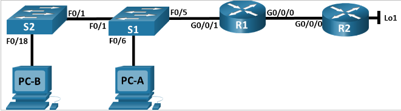

# Лабораторная работа №13 Настройка NAT

## Топология



## Таблица адресации

|Устройство|Интерфейс|IP-адрес|маска подсети|
|----------|---------|--------|-------------|
|R1|G0/0/0|209.165.200.230|255.255.255.248|
| |G0/0/1|192.168.1.1|255.255.255.0|
|R2|G0/0/0|209.165.200.1|255.255.255.248|
| |Lo1|209.165.200.1|255.255.255.224|
|S1|VLAN1|192.168.1.11|255.255.255.0|
|S2|VLAN1|192.168.1.12|255.255.255.0|
|PC-A|NIC|192.168.1.2|255.255.255.0|
|PC-B|NIC|192.168.1.3|255.255.255.0|

### Базовая настройка маршрутизаторов

- R1

```
hostname R1
no ip domain-lookup
enable secret class
line console 0
password cisco
login
exit
line vty 0 4
password cisco
login
exit
service password-encryption
banner motd cDostup Zapreshenc
interface g0/0/0
ip address 209.165.200.230 255.255.255.248
no shutdown
interface g0/0/1
ip address 192.168.1.1 255.255.255.0
no shutdown
exit
ip route 209.165.200.0 255.255.255.224 209.165.200.225
```

- R2

```
hostname R2
no ip domain-lookup
enable secret class
line console 0
password cisco
login
exit
line vty 0 4
password cisco
login
exit
service password-encryption
banner motd cDostup Zapreshenc
interface g0/0/0
ip address 209.165.200.225 255.255.255.248
no shutdown
interface loopback 1
ip address 209.165.200.1 255.255.255.224
exit
ip route 0.0.0.0 0.0.0.0 209.165.200.225
```

### Базовая настройка коммутаторов

- S1
```
hostname S1
no ip domain-lookup
enable secret class
line console 0
password cisco
login
exit
line vty 0 15
password cisco
login
exit
service password-encryption
banner motd c
!!!!!!!!!!!!!!!!!!!!!!!!!!!!!!!!!!!!!!!!!!!!!!
!!!!!!!!!!!!!!!DOSTUP ZAPRESHEN!!!!!!!!!!!!!!!
!!!!!!!!!!!!!!!DOSTUP ZAPRESHEN!!!!!!!!!!!!!!!
!!!!!!!!!!!!!!!DOSTUP ZAPRESHEN!!!!!!!!!!!!!!!
!!!!!!!!!!!!!!!!!!!!!!!!!!!!!!!!!!!!!!!!!!!!!!c
interface vlan 1
ip address 192.168.1.11 255.255.255.0
no shutdown
exit
interface range fa0/2-4, fa0/7-24, g0/1-2
shutdown
```

- S2

```
hostname S2
no ip domain-lookup
enable secret class
line console 0
password cisco
login
exit
line vty 0 15
password cisco
login
exit
service password-encryption
banner motd c
!!!!!!!!!!!!!!!!!!!!!!!!!!!!!!!!!!!!!!!!!!!!!!
!!!!!!!!!!!!!!!DOSTUP ZAPRESHEN!!!!!!!!!!!!!!!
!!!!!!!!!!!!!!!DOSTUP ZAPRESHEN!!!!!!!!!!!!!!!
!!!!!!!!!!!!!!!DOSTUP ZAPRESHEN!!!!!!!!!!!!!!!
!!!!!!!!!!!!!!!!!!!!!!!!!!!!!!!!!!!!!!!!!!!!!!c
interface vlan 1
ip address 192.168.1.12 255.255.255.0
no shutdown
exit
interface range fa0/2-17, fa0/19-24, g0/1-2
```

### Настройка и проверка NAT

- R1

```
access-list 1 permit 192.168.1.0 0.0.0.255
ip nat pool PUBLIC_ACCESS 209.165.200.226 209.165.200.228 netmask 255.255.255.248
ip nat inside source list 1 pool PUBLIC_ACCESS
interface g0/0/1
ip nat inside
exit
interface g0/0/0
ip nat outside
end
```

Проверка

- PC-B

```
C:\>ping -t 209.165.200.1

Pinging 209.165.200.1 with 32 bytes of data:

Request timed out.
Reply from 209.165.200.1: bytes=32 time=12ms TTL=254
Reply from 209.165.200.1: bytes=32 time<1ms TTL=254
Reply from 209.165.200.1: bytes=32 time=12ms TTL=254
```

- R1

```
show ip nat translations
Pro  Inside global     Inside local       Outside local      Outside global
icmp 209.165.200.226:10192.168.1.3:10     209.165.200.1:10   209.165.200.1:10
icmp 209.165.200.226:11192.168.1.3:11     209.165.200.1:11   209.165.200.1:11
icmp 209.165.200.226:1 192.168.1.3:1      209.165.200.1:1    209.165.200.1:1
icmp 209.165.200.226:2 192.168.1.3:2      209.165.200.1:2    209.165.200.1:2
icmp 209.165.200.226:3 192.168.1.3:3      209.165.200.1:3    209.165.200.1:3
icmp 209.165.200.226:4 192.168.1.3:4      209.165.200.1:4    209.165.200.1:4
icmp 209.165.200.226:5 192.168.1.3:5      209.165.200.1:5    209.165.200.1:5
icmp 209.165.200.226:6 192.168.1.3:6      209.165.200.1:6    209.165.200.1:6
icmp 209.165.200.226:7 192.168.1.3:7      209.165.200.1:7    209.165.200.1:7
icmp 209.165.200.226:8 192.168.1.3:8      209.165.200.1:8    209.165.200.1:8
icmp 209.165.200.226:9 192.168.1.3:9      209.165.200.1:9    209.165.200.1:9
```

Из вывода видно:
- Что внутренний локальный адрес 192.168.1.3 транслирован во внутренний глобальный адрес 209.165.200.226
- Переведённым адресом является глобальный внутренний алрес 209.165.200.226
- При дальнейших пингах с PC-A и S1 устройства получат адреса 209.165.200.227 и 209.165.200.228. Попытка пинга с S2 будет неудачной так как весь пул будет занят.

### настройка PAT с перегрузкой пула адресов

- R1

```
no ip nat inside source list 1 pool PUBLIC_ACCESS
ip nat inside source list 1 pool PUBLIC_ACCESS overload
```

Проверка

- PC-B

```
C:\>ping -t 209.165.200.1

Pinging 209.165.200.1 with 32 bytes of data:

Reply from 209.165.200.1: bytes=32 time<1ms TTL=254
Reply from 209.165.200.1: bytes=32 time=12ms TTL=254
Reply from 209.165.200.1: bytes=32 time=12ms TTL=254
Reply from 209.165.200.1: bytes=32 time=13ms TTL=254
Reply from 209.165.200.1: bytes=32 time=12ms TTL=254
```

- R1
```
R1#show ip nat translations 
Pro  Inside global     Inside local       Outside local      Outside global
icmp 209.165.200.226:28192.168.1.3:28     209.165.200.1:28   209.165.200.1:28
icmp 209.165.200.226:29192.168.1.3:29     209.165.200.1:29   209.165.200.1:29
icmp 209.165.200.226:30192.168.1.3:30     209.165.200.1:30   209.165.200.1:30
icmp 209.165.200.226:31192.168.1.3:31     209.165.200.1:31   209.165.200.1:31
icmp 209.165.200.226:32192.168.1.3:32     209.165.200.1:32   209.165.200.1:32
icmp 209.165.200.226:33192.168.1.3:33     209.165.200.1:33   209.165.200.1:33
icmp 209.165.200.226:34192.168.1.3:34     209.165.200.1:34   209.165.200.1:34
icmp 209.165.200.226:35192.168.1.3:35     209.165.200.1:35   209.165.200.1:35
icmp 209.165.200.226:36192.168.1.3:36     209.165.200.1:36   209.165.200.1:36
icmp 209.165.200.226:37192.168.1.3:37     209.165.200.1:37   209.165.200.1:37
icmp 209.165.200.226:38192.168.1.3:38     209.165.200.1:38   209.165.200.1:38
icmp 209.165.200.226:39192.168.1.3:39     209.165.200.1:39   209.165.200.1:39
icmp 209.165.200.226:40192.168.1.3:40     209.165.200.1:40   209.165.200.1:40
icmp 209.165.200.226:41192.168.1.3:41     209.165.200.1:41   209.165.200.1:41
icmp 209.165.200.226:42192.168.1.3:42     209.165.200.1:42   209.165.200.1:42
icmp 209.165.200.226:43192.168.1.3:43     209.165.200.1:43   209.165.200.1:43
icmp 209.165.200.226:44192.168.1.3:44     209.165.200.1:44   209.165.200.1:44
icmp 209.165.200.226:45192.168.1.3:45     209.165.200.1:45   209.165.200.1:45
icmp 209.165.200.226:46192.168.1.3:46     209.165.200.1:46   209.165.200.1:46
icmp 209.165.200.226:47192.168.1.3:47     209.165.200.1:47   209.165.200.1:47
icmp 209.165.200.226:48192.168.1.3:48     209.165.200.1:48   209.165.200.1:48
icmp 209.165.200.226:49192.168.1.3:49     209.165.200.1:49   209.165.200.1:49
icmp 209.165.200.226:50192.168.1.3:50     209.165.200.1:50   209.165.200.1:50
icmp 209.165.200.226:51192.168.1.3:51     209.165.200.1:51   209.165.200.1:51
icmp 209.165.200.226:52192.168.1.3:52     209.165.200.1:52   209.165.200.1:52
icmp 209.165.200.226:53192.168.1.3:53     209.165.200.1:53   209.165.200.1:53
```

из вывода видно:
- Что внутренний локальный адрес 192.168.1.3 транслирован во внутренний глобальный адрес 209.165.200.226
- Переведённым адресом является глобальный внутренний алрес 209.165.200.226
- В cisco packet tracer различий при выводе команды `show ip nat translations` нет
- В cisco packet tracer команда `show ip nat translations verbose` не поддерживается
- Маршрутизатор использует таблицу трансляций, в которой для каждого сеанса хранится соответствие между внутренним локальным адресом:портом и внутренним глобальным адресом:портом, а также внешним адресом и портом. При получении ответного пакета он по адресу назначения и порту находит соответствующую запись и заменяет адрес и порт назначения на исходные внутренние локальные, направляя пакет правильному хосту.


### Переход к PAT с перегрузкой интерфейсов

- R1

```
clear ip nat translations *
no ip nat inside source list 1 pool PUBLIC_ACCESS overload
no ip nat pool PUBLIC_ACCESS
ip nat inside source list 1 interface g0/0/0 overload
```

Проверка

- При генерации трафика с PC-A, PC-B, S1, S2 в таблице трансляций следующий вывод

```
R1#sho ip nat tr
Pro  Inside global     Inside local       Outside local      Outside global
icmp 209.165.200.230:1024192.168.1.11:2     209.165.200.1:2    209.165.200.1:1024
icmp 209.165.200.230:1025192.168.1.11:3     209.165.200.1:3    209.165.200.1:1025
icmp 209.165.200.230:1026192.168.1.11:4     209.165.200.1:4    209.165.200.1:1026
icmp 209.165.200.230:1027192.168.1.11:5     209.165.200.1:5    209.165.200.1:1027
icmp 209.165.200.230:27192.168.1.2:27     209.165.200.1:27   209.165.200.1:27
icmp 209.165.200.230:28192.168.1.2:28     209.165.200.1:28   209.165.200.1:28
icmp 209.165.200.230:29192.168.1.2:29     209.165.200.1:29   209.165.200.1:29
icmp 209.165.200.230:2 192.168.1.12:2     209.165.200.1:2    209.165.200.1:2
icmp 209.165.200.230:30192.168.1.2:30     209.165.200.1:30   209.165.200.1:30
icmp 209.165.200.230:31192.168.1.2:31     209.165.200.1:31   209.165.200.1:31
icmp 209.165.200.230:32192.168.1.2:32     209.165.200.1:32   209.165.200.1:32
icmp 209.165.200.230:33192.168.1.2:33     209.165.200.1:33   209.165.200.1:33
icmp 209.165.200.230:34192.168.1.2:34     209.165.200.1:34   209.165.200.1:34
icmp 209.165.200.230:35192.168.1.2:35     209.165.200.1:35   209.165.200.1:35
icmp 209.165.200.230:36192.168.1.2:36     209.165.200.1:36   209.165.200.1:36
icmp 209.165.200.230:3 192.168.1.12:3     209.165.200.1:3    209.165.200.1:3
icmp 209.165.200.230:4 192.168.1.12:4     209.165.200.1:4    209.165.200.1:4
icmp 209.165.200.230:5 192.168.1.12:5     209.165.200.1:5    209.165.200.1:5
icmp 209.165.200.230:83192.168.1.3:83     209.165.200.1:83   209.165.200.1:83
icmp 209.165.200.230:84192.168.1.3:84     209.165.200.1:84   209.165.200.1:84
icmp 209.165.200.230:85192.168.1.3:85     209.165.200.1:85   209.165.200.1:85
icmp 209.165.200.230:86192.168.1.3:86     209.165.200.1:86   209.165.200.1:86
icmp 209.165.200.230:87192.168.1.3:87     209.165.200.1:87   209.165.200.1:87
icmp 209.165.200.230:88192.168.1.3:88     209.165.200.1:88   209.165.200.1:88
icmp 209.165.200.230:89192.168.1.3:89     209.165.200.1:89   209.165.200.1:89
icmp 209.165.200.230:90192.168.1.3:90     209.165.200.1:90   209.165.200.1:90
icmp 209.165.200.230:91192.168.1.3:91     209.165.200.1:91   209.165.200.1:91
```

Все внутренние глобальные адреса теперь совпадают с IP-адресом интерфейса G0/0/0 (209.165.200.230), а порты различаются.


### Настройка статического NAT

- R1

```
clear ip nat translation *
ip nat inside source static 192.168.1.2 209.165.200.229
```

Проверка

- R1

```
sho ip nat translations 
Pro  Inside global     Inside local       Outside local      Outside global
---  209.165.200.229   192.168.1.2        ---                ---
```

- R2

```
ping 209.165.200.229

Type escape sequence to abort.
Sending 5, 100-byte ICMP Echos to 209.165.200.229, timeout is 2 seconds:
.!!!!
Success rate is 80 percent (4/5), round-trip min/avg/max = 0/0/0 ms
```

- R1

```
show ip nat translations 
Pro  Inside global     Inside local       Outside local      Outside global
icmp 209.165.200.229:2 192.168.1.2:2      209.165.200.225:2  209.165.200.225:2
icmp 209.165.200.229:3 192.168.1.2:3      209.165.200.225:3  209.165.200.225:3
icmp 209.165.200.229:4 192.168.1.2:4      209.165.200.225:4  209.165.200.225:4
icmp 209.165.200.229:5 192.168.1.2:5      209.165.200.225:5  209.165.200.225:5
---  209.165.200.229   192.168.1.2        ---                ---
```
